# Case Study: Isle of May's Guillemot

> **Note**: *This article uses data that is not bundled with the
> package, so the analysis is not immediately reproducible. To access
> the necessary data, please reach out to the package maintainers.*

## Overview

Here we use roamR to simulate the movement and energetics for a
population of common guillemot (*Uria aalge*) on the Isle of May. For
broad-scale details on the roamR package, refer to the general guide,
with the general architecture repeated here:


The simulations here cover the non-breeding season (some 9 months, from
July to March) under two broad scenarios:

- An environment free of Offshore Windfarms (OWFs) - nominally the
  status quo
- An environment with many synthetic OWF developments


*Synthetic windfarms within North Sea, against a predicted guillemot
density surface (average counts/10km^2 in October). Density is clipped
to the area oo calculation (AOC), windfarms are the light yellow boxes.
Anything beyond the AOC boundaries are excluded from calculations*

 

The overall aim is to quantify the effects of potential displacement
from these OWF developments, based on counterfactual comparisons of
animal’s condition under the two scenarios. In line with the
architecture of the roamR package, the simulation requires specifying
the following main components:

- **IBM configuration** (`<ModelConfig>`)

  Sundry high-level simulation controls, including the number of agents,
  spatial extent and geographic projection, temporal resolution, start
  and end dates of the model run.

- **Species-level information** (`<Species>`)

  Parameters describing the species’ biology and ecology, such as
  distributions for initial body mass, available activity states and
  associated energetic costs, movement parameters, how agents respond to
  environmental conditions and barriers, etc.

- **Drivers** (`<Driver>`)

  Descriptions/data that define the environment that agents may interact
  with or respond to e.g. population density maps, sea surface
  temperatures, OWF locations, coastlines, etc.

The extent to which these can be reliably populated will obviously vary
across species and regions. The Isle of May Guillemot population is used
here as case study due to the availability of relatively rich supporting
data.

The roamR infrastructure is intentionally general and flexible, and many
of its broader capabilities are not required for this example. In the
following sections, we will systematically populate the relevant IBM
components, before running the simulation and post-processing the
results.

## Settting up the IBM

We begin by defining the model settings and specifying the inputs
required to initialise an IBM for this case study using roamR.

### Data Availability

As a relatively well-studied species/population, many roamR components
can be populated using available data. In this vignette, we draw on:

- Density maps
- SST
- Activity data
- Energetics
- Species’ bodyweight distributions
- Body mass conversion

These datasets are (a) described in detail and (b) implemented in
appropriate roamR object classes in the following sections.

Note: although roamR can operate with minimal data inputs - illustrated
in the alternative test case for red‑throated divers - results in such
cases will be inherently more uncertain and more strongly driven by
stochastic variation.

### IBM configuration

The broad configuration of the IBM is specified via the function
[`ModelConfig()`](https://dmpstats.github.io/roamR/reference/ModelConfig.md).
In the interest of speed, the example simulation here will not be large
in terms of the number of agents to run - we’ll opt for few agents
(`n_agents`), whereas a typical run would usually involve several
thousands of individuals. For guillemots, the non-breeding season spans
roughly 9 months beginning in early July, which we specify using the
`start_date` and `end_date` arguments. We set the temporal resolution to
one-day time steps (`delta_time`), meaning that agent state updates -
such as activity balancing and movement decisions - are evaluated on a
daily basis.

We’ll opt to our simulation to operate on the UTM 30N coordinate system
(`ref_sys`), which forms the basis for ingesting, projecting and
aligning all the spatial inputs throughout the model workflow.

Note: the [sf](https://r-spatial.github.io/sf/) package is generally
used for dealing with spatial data , and the interlinked
[stars](https://r-spatial.github.io/stars/) package for spatiotemporal
information.

``` r
# define UTM zone 30N
utm30 <- st_crs(32630)
```

Agent starting and ending locations (`start_sites`, `end_sites`) must be
supplied as `<sf>` objects containing two required columns:

- `id`, a unique site identifier
- `prop`, the proportion of agents assigned to each site.

In this example, we use the Isle of May as the sole starting location,
specified as a geometric point by its geographic (longitude/latitude)
coordinates. We do not make use of `end_sites` in this simulation;
agents simply remain at their final positions once the simulation ends.

Because
[`ModelConfig()`](https://dmpstats.github.io/roamR/reference/ModelConfig.md)
expects spatial inputs to match the CRS defined by `ref_sys`, the site
must be projected to UTM Zone 30N.

``` r
# location of colony in long/lat degrees - start/finish locations
isle_may <- st_sf(
  id = "Isle of May",
  prop = 1,
  geom = st_sfc(st_point(c(-2.5667, 56.1833))),
  crs = 4326) 

# re-project to UTM 30N
isle_may <- st_transform(isle_may, crs = utm30)
```

In terms of bounding the simulation spatially, we’ve opted for a
semi-arbitrary bounding box around the Isle of May that encompasses a
large swathe of the North Sea and far to the west of the UK, which
covers the bulk of the guillemot density maps. Importantly, this a hard
boundary in terms of simulations - data outside this will have no
influence.

``` r
# define the Area of Calculation
AoC <- st_bbox(c(xmin = 178831, ymin = 5906535,  xmax = 1174762, ymax = 6783609), crs = st_crs(utm30))
```

In this case study, we adopt the **density-informed** movement model
(`movement_type`, refer guidance document), under which species-level
density maps influence agent movement by providing a spatio-temporal
varying preference surface.

Passing the above configuration inputs to
[`ModelConfig()`](https://dmpstats.github.io/roamR/reference/ModelConfig.md)
creates a `<ModelConfig>` object, which we assigned to
`guill_ibm_config`:

``` r
# IBM Settings - assume fixed for these simulations
guill_ibm_config <- ModelConfig(
  movement_type = "di",
  n_agents = 4,
  ref_sys = utm30,
  aoc_bbx = AoC,
  delta_time = "1 day",
  start_date = lubridate::date("2025-07-01"),
  end_date = lubridate::date("2025-07-01") + lubridate::days(9*30), # 1 month ~ 30 days
  start_sites = isle_may
)

# show created <ModelConfig> object
guill_ibm_config
#> <ModelConfig> instance with attributes:
#> • Movement Model:      Density-informed
#> • No. Agents:          4
#> • Simulation period:   2025-07-01 -- 2026-03-28 (270 days)
#> • Temporal resolution: 1 day
#> • Bounding box:        xmin: 178831  ymin: 5906535  xmax: 1174762  ymax: 6783609 [m]
#> • Projected CRS:       WGS 84 / UTM zone 30N
#> • Start site:          Simple feature with 1 feature and 2 fields [WGS 84 / UTM zone 30N]
#>               id prop                     geom
#>    1 Isle of May    1 POINT (526895.8 6226565)
#> • End site:            NA
```

### Driver information: specifying the environment

In roamR, *drivers* define the environmental context with which agents
may interact with or to which they may respond. Each driver is defined
by a `<Driver>` object, which can be created using the
[`Driver()`](https://dmpstats.github.io/roamR/reference/Driver.md)
function. The scope of these will be defined by the level of knowledge
for the species of interest - at the minimum the agents would not be
responsive to the environment. Any environmental component that can/will
be functionally linked to the animal’s behaviour (activity states or
movement) or their energetic expenditures, must be included in the
definition of the environment via the drivers.

In this application to the common guillemot, the following drivers are
required - all provided as spatio-temporal datacubes (2D rasters giving
values for $x,y$ locations over time $t$) so the agents can query their
environment at any $x,y,t$:

- Monthly species density surfaces, for both baseline and impacted
  scenarios (Buckingham et al. 2023). These give monthly density
  predictions around the UK at a 10 km^2 resolution (with bootstrap
  uncertainties).

- Monthly energy intake maps (kJ/h), for both baseline and impacted
  scenarios based on density maps above, and conspecifics (other
  Guillemots, refer below).

- Monthly average Sea Surface Temperature (SST) maps (National Oceanic
  and Atmospheric Administration/NOAA
  [here](https://downloads.psl.noaa.gov/Datasets/noaa.oisst.v2.highres/)).

roamR enforces a strict requirement that all input variables be
accompanied by appropriate measurement units. This ensures that all
computations performed during simulation are unit-aware, allowing for
accurate operations and conversions.

We begin by uploading these datacubes, assigning measurement units where
they are missing.

``` r
# upload available spatial surfaces

## population density maps: baseline and impacted scenarios
spec_map <- readRDS("data/bioss_spec_map.rds") |> 
   mutate(density =  units::set_units(density, "counts/10km^2"))

spec_imp_map <- readRDS("data/bioss_spec_imp_map.rds") |> 
   mutate(density =  units::set_units(density, "counts/10km^2"))

dpal <- hcl.colors(10, palette = "GnBu", rev = TRUE)
plot(spec_map, col = dpal, breaks = "equal")
```

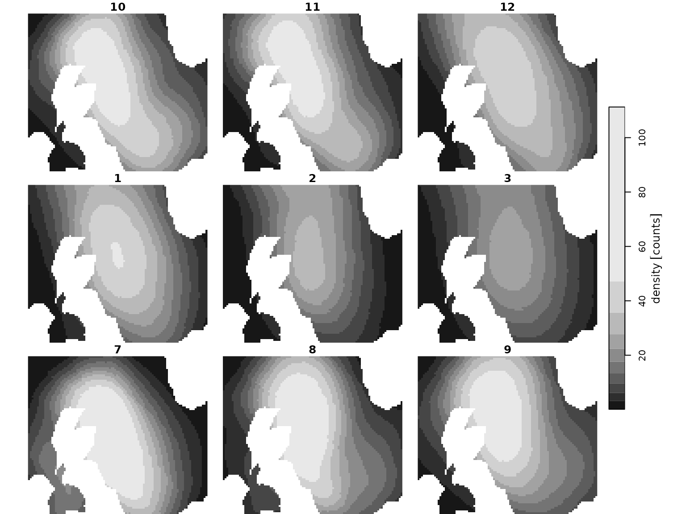

``` r
plot(spec_imp_map, col = dpal, breaks = "equal")
```

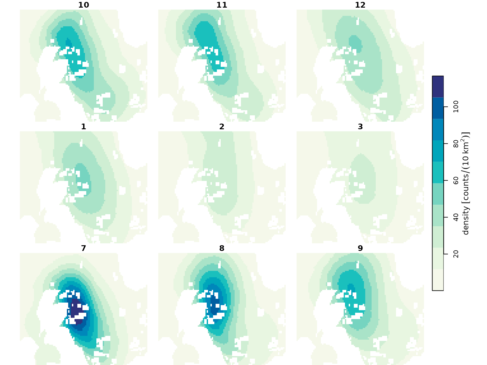

``` r

## Energy intake maps: basline and ipacted scenarios
intake_map <- readRDS("data/guill_energy_intake_map.rds")
imp_intake_map <- readRDS("data/guill_impacted_energy_intake_map.rds")

ipal <- hcl.colors(10, palette = "PurpOr", rev = TRUE)
plot(intake_map, col = ipal[length(ipal)], breaks = "equal")
```


``` r
plot(imp_intake_map, col = ipal, breaks = "equal")
```

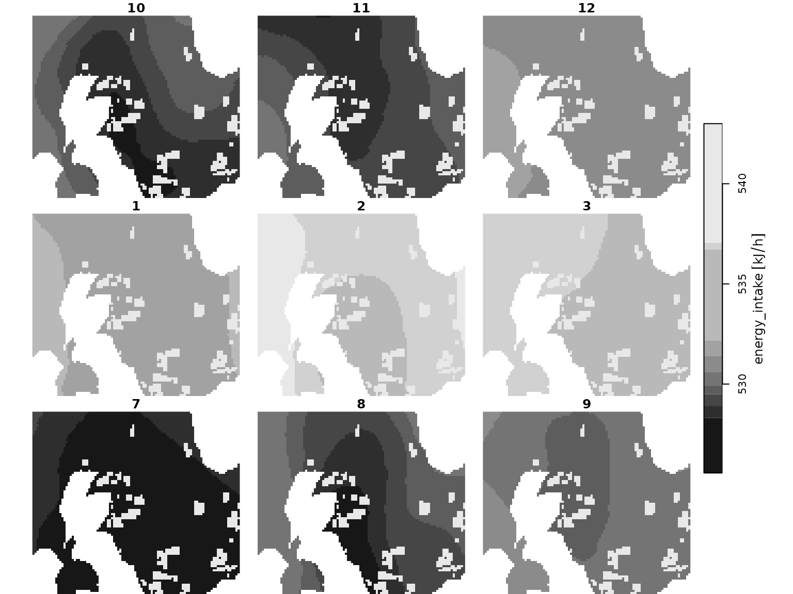

``` r

## Sea surface temperature rasters
sst_map <- readRDS("data/sst_stars.rds") 
plot(sst_map, col = hcl.colors(12, palette = "Zissou 1"), breaks = "equal")
```

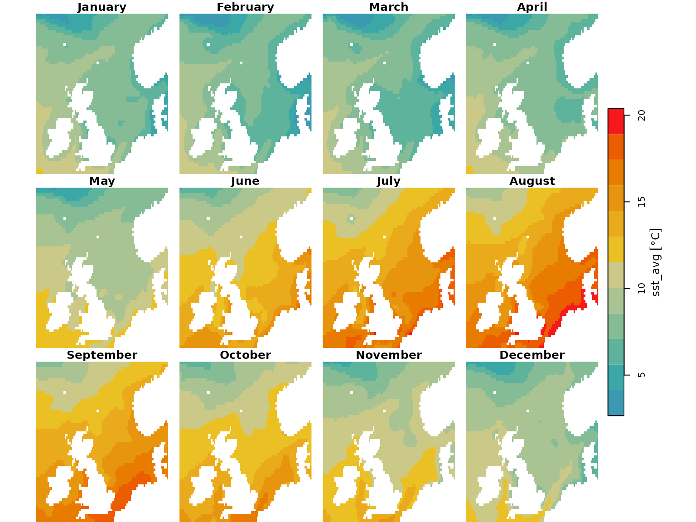

 

Next we specify the corresponding drivers, and stored them as a list of
`<Driver>` objects. Collectively these lists define the environment the
agents will move through, offering flexibility to comprise spatial
features such as coastal polygons, OWF footprints, prey-fields, etc.

In our specific case:

- Density maps are used in the *density-informed* movement model,
  guiding agents toward areas with higher habitat preference while
  implicitly excluding land as potential destinations. Likewise, OWF
  footprints are incorporated as spatial holes in the “impact” density
  surfaces, defining no‑go areas for OWF‑sensitive agents.

- Energetic maps represent spatial variation in energetic gain:

  - in the unimpacted scenario, the energetics surface reflects an Ideal
    Free Distribution (IFD): on average, agents meet their energetic
    requirements, and their spatial distribution reflects the underlying
    resource landscape.

  - under the impacted scenario, the energetics surface incorporates
    displacement caused by OWFs and the resulting redistribution of
    conspecifics. Increased competition reduces available resources
    proportionally - for example, a doubling of local density leads to
    halved resource availability.

- Sea surface temperature is used in the calculation of activity-state
  energetics through time, specifically affecting the energetic costs
  experienced by agents while on water (swimming and resting, see
  below).

``` r
# Set up IBM drivers 

# guillemot baseline density maps
dens_drv <- Driver(
  id = "dens",
  descr = "species dens map",
  stars_obj = spec_map,
  obj_active = "stars"
)

# guillemot impacted density maps
dens_imp_drv <- Driver(
  id = "dens_imp",
  descr = "species redist map",
  stars_obj = spec_imp_map,
  obj_active = "stars"
)

# baseline energy intake maps
energy_drv <- Driver(
  id = "energy",
  descr = "energy map",
  stars_obj = intake_map,
  obj_active = "stars"
)

# impacted energy intake maps
imp_energy_drv <- Driver(
  id = "imp_energy",
  descr = "energy impact map",
  stars_obj = imp_intake_map,
  obj_active = "stars"
)

# Sea Surface Temperature 
sst_drv <- Driver(
  id = "sst",
  descr = "Sea Surface Temperature",
  stars_obj = sst_map,
  obj_active = "stars"
)


# store as list, for initialisation
guill_drivers <- list(
  dens = dens_drv,
  imp_dens = dens_imp_drv,
  energy = energy_drv,
  imp_energy = imp_energy_drv,
  sst = sst_drv
)
```

### Species information: properties underpinning individual agents

Species-level information is defined using the
[`Species()`](https://dmpstats.github.io/roamR/reference/Species.md)
function, which depends on a set of input objects. For clarity and
modularity, these inputs should be prepared and specified beforehand.

#### States Profile

We begin by defining the behavioural states to include in the model.
Each state represents a specific activity, characterized by parameters
such as energy expenditure, time allocation, and movement speed.

States are created using the
[`State()`](https://dmpstats.github.io/roamR/reference/State.md)
function. roamR supports flexible specification of state properties,
allowing the incorporation of stochastic variation at both the
population and individual (agent) level.

Here we include 4 states:

- flying
- diving
- active on water (i.e. swimming)
- inactive on water (i.e. resting)

##### Flying

We start with the *flight* state. For this simulation, we assume the
energetic cost (`energy_cost`) of flying for each agent varies
throughout the simulation, following a Normal distribution with mean
507.6 kJ/h and standard deviation of 237.6 kJ/h. The source for these
figures are Elliott et al. (2013).

Stochasticity can enter the state specification in further ways. Here we
assume that each agent has a fixed average flying speed for the entire
simulation (representing inherently faster or slower individuals), with
speeds drawn from a Uniform distribution as specified below (`speed`).
The proportion of time allocated to flight at the initial time step
(`time_budget`) is set to 0.056 h/day for all simulated agents.

``` r
# user-defined function returning a non-negative energy cost of flying
flight_cost_fn <- function(mean, sd){
  e <- rnorm(1, mean, sd)
  units::set_units((max(e, 1)), "kJ/h")
}

# define <State> object for flight activity
flight <- State(
  id = "flight", 
  energy_cost = VarFn(
    flight_cost_fn, 
    args_spec = list(mean = 507.6, sd = 237.6), 
    units = "kJ/hour"
    ), 
  time_budget = VarDist(0.056, "hours/day"), 
  speed = VarDist(dist_uniform(10, 20), "m/s")
)

# inspect flight object
flight
#> An object of class "State"
#> Slot "id":
#> [1] "flight"
#> 
#> Slot "energy_cost":
#> <VarFn>
#> function (mean, sd) 
#> {
#>     e <- rnorm(1, mean, sd)
#>     units::set_units((max(e, 1)), "kJ/h")
#> }
#> 
#> Args:
#> • `mean`: 507.6
#> • `sd`: 237.6
#> 
#> Output units: [kJ h-1]
#> 
#> Slot "time_budget":
#> <VarDist>
#> 0.056 [h d-1]
#> 
#> Slot "speed":
#> <VarDist>
#> U(10, 20) [m s-1]
```

To ensure biologically realistic behaviour, `flight_cost_fn()`
constrains sampled energy costs to a minimum of 1 kJ/h, avoiding the
occasional negative values produced by a Normal distribution. The plots
below illustrate the distributions that will be sampled for the
stochastic elements of the `"flight"` state — specifically, per‑step
energy costs and per‑agent flight speeds.

``` r
## generate random samples of energy cost and flight speed
set.seed(1991)
flight_draws <- tibble(
  `Flight cost` = replicate(2000, flight_cost_fn(507.6, 237.6), simplify = FALSE) |> list_c(),
  `Flight speed` = roamR::generate(flight@speed, 2000)
)

p1 <- ggplot(flight_draws) +
  geom_density(aes(`Flight speed`), fill = "#EFEBE9", col = "gray20") +
  labs(subtitle = "Per agent at initialization")

p2 <- ggplot(flight_draws) +
  geom_density(aes(`Flight cost`), fill = "#EFEBE9", col = "gray20") +
  labs(subtitle = "Per agent at each simulation step")

(p1 + p2) + plot_annotation(title = "'flight' state: sampling distributions")
```

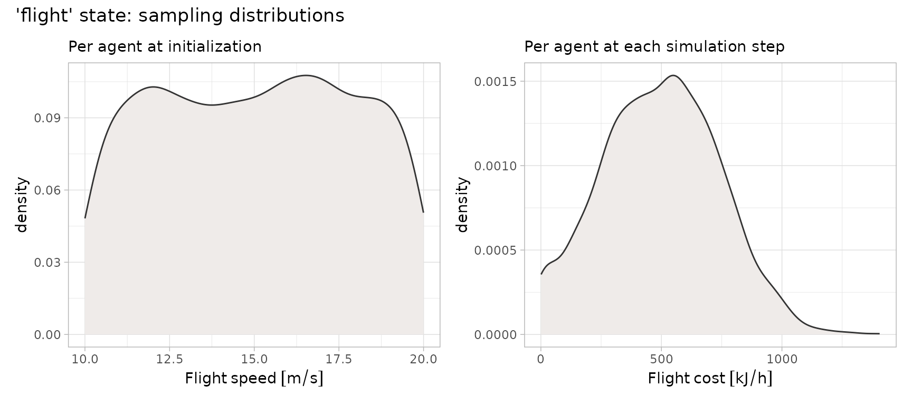

##### Diving

For the state representing the *diving* activity, the energy output is
contingent on the amount of diving (Elliott et al. 2013).

$$e = 3.71\frac{\sum\limits_{i}\left( 1 - e^{- T_{i}/1.23} \right)}{\sum\limits_{i}T_{i}}$$

Where $T_{i}$ is the length of dive $i$ in minutes. Here we are
performing day-level calculations, meaning we are far from simulating at
the dive level, and can use a mean dive-length without loss of
generality. This is specified as parameter `t_dive` in the defined
diving cost function, with input value derived from tag information.

To introduce agent‑level stochasticity, we allow the energetic
multiplier in the above equation (the leading coefficient, 3.71) to vary
among individuals. We therefore parameterise this multiplier as `alpha`,
assuming it follows a Normal distribution with mean 3.71 and standard
deviation 1.3, such that each agent’s diving cost fluctuates throughout
the simulation. Diving energy costs are also constrained to a minimum of
1 kJ/h.

Diving speeds are drawn from a Uniform distribution, and initial time
allocated to diving is set to 3.11 h/day.

``` r
# define costing function, with non-negative cost constraint
dive_cost_fn <- function(t_dive, alpha_mean, alpha_sd){
  alpha <- rnorm(1, alpha_mean, alpha_sd)
  (max(alpha*sum(1-exp(-t_dive/1.23))/sum(t_dive)*60, 1)) |>
    units::set_units("kJ/h")
}

# Construct <State> object
dive <- State(
  id = "diving", 
  energy_cost = VarFn(
    dive_cost_fn, 
    args_spec = list(t_dive = 1.05, alpha_mean = 3.71, alpha_sd = 1.3), 
    units = "kJ/hour"
    ), 
  time_budget = VarDist(3.11, "hours/day"), 
  speed = VarDist(dist_uniform(0, 1), "m/s")
)
```

The following plots illustrate the sampling distributions specified for
drawing random values of movement speeds and energetic costs associated
with *diving*.

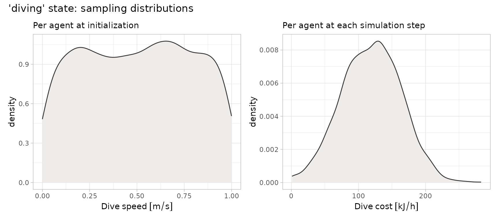

##### Active on Water

State representing *active on water* (Buckingham et al. 2023) is a
linear function in sea surface temperature (SST):

$$e = a - (b*SST)$$

where the intercept $a$ has a mean of 113 and SD of 22. $b$ is a
constant of 2.75.

Because this state explicitly depends on SST, we must ensure that the
corresponding driver is linked correctly within the `<State>` object.
This is achieved through the `args_spec` argument in
[`State()`](https://dmpstats.github.io/roamR/reference/State.md).
Specifically, we include a list element named `sst`, set to `"driver"`,
which instructs roamR to retrieve SST values from the `"sst"` driver
defined earlier in the vignette.

The specification of the remaining attributes for this state follows the
same principles used for the previous states.

``` r
# define water-active cost function, with non-negative cost constraint
active_water_cost_fn <- function(sst, int_mean, int_sd){
  int <- rnorm(1, int_mean, int_sd)
  (max(int-(2.75*sst), 1)) |>
    units::set_units("kJ/h")
}

# Construct <State> object
active <- State(
  id = "active_on_water", 
  energy_cost = VarFn(
    active_water_cost_fn, 
    args_spec = list(sst = "driver", int_mean = 113, int_sd = 22), 
    units = "kJ/hour"
  ), 
  time_budget = VarDist(10.5, "hours/day"), 
  speed = VarDist(dist_uniform(0, 1), "m/s")
)
```

``` r
## generate random samples
set.seed(1991)

# gather cost function argument values 
i_mn <- active@energy_cost@args_spec$int_mean@value
i_sd <- active@energy_cost@args_spec$int_sd@value
sst_range <- range(sst_map[[1]], na.rm = TRUE)
sst <- seq(sst_range[1], sst_range[2], by = 1)

n <- 1000

active_cost_draws <- tibble(
  sst,
  draw = list(1:n),
  `Active cost` = map(
    drop_units(sst), 
    \(x) replicate(n, active_water_cost_fn(x, i_mn, i_sd), simplify = FALSE) |> list_c()
  )
) |> 
  unnest(c(`Active cost`, draw))

p1 <- tibble(`Active speed` = roamR::generate(active@speed, 2000)) |> 
  ggplot() +
  geom_density(aes(`Active speed`), fill = "#EFEBE9", col = "gray20") +
  labs(subtitle = "Per agent at initialization")


p2 <- active_cost_draws |>
  ggplot(aes(x = sst, y = `Active cost`)) +
  stat_lineribbon() +
  scale_fill_manual(values = c( "#EFEBE9", "#D7CCC8", "#A1887F")) +
  labs(subtitle = "Per agent at each simulation step")
  #scale_fill_brewer(palette = "Greys")
   
(p1 + p2) + plot_annotation(title = "'active on water' state: sampling distributions")
```

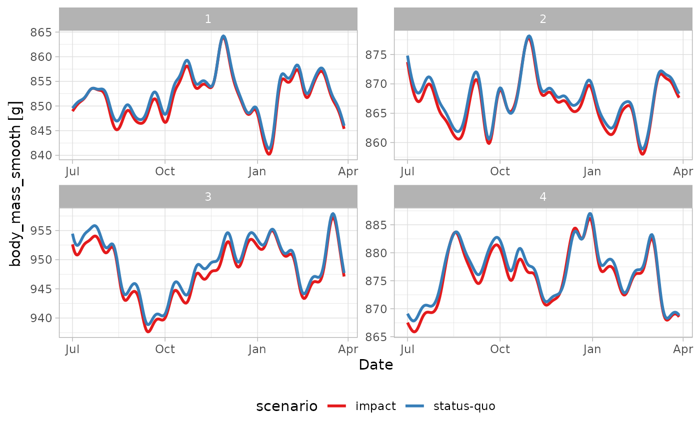

##### Inactive on Water

State for *inactive on water* (Buckingham et al. 2023), follows the same
linear function in SST, but where $a$ has a mean of 72.2 and SD of 22.
$b$ is similarly constant at 2.75.

``` r
inactive_water_cost_fn <- function(sst, int_mean, int_sd){
  int <- rnorm(1, int_mean, int_sd)
  (max(int-(2.75*sst), 1)) |>
    units::set_units("kJ/h")
}

inactive <- State(
  id = "inactive_on_water", 
  energy_cost = VarFn(
    active_water_cost_fn, 
    args_spec = list(sst = "driver", int_mean = 72.2, int_sd = 22), 
    units = "kJ/hour"
  ), 
  time_budget = VarDist(10.3, "hours/day"), 
  speed = VarDist(dist_uniform(0, 1), "m/s")
)
```

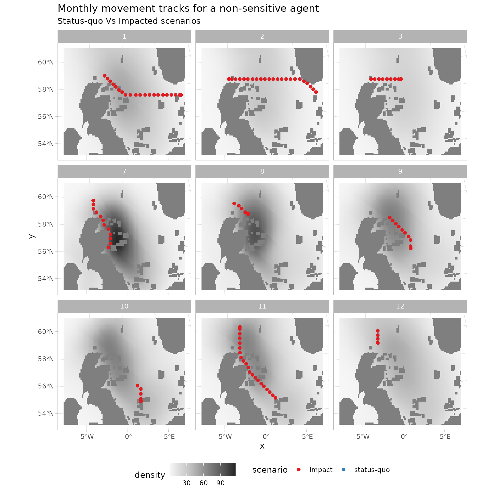

#### Driver Responses

In this section, we define species-level, agent-specific responses to
the environmental drivers introduced and defined earlier. For the
guillemot model, we assign the density drivers - identified as `"dens"`
(baseline) and `"dens_imp"` (impacted) - as the primary determinants of
agent movement (density maps as per Buckingham et al. (2022)).

For each scenario, we also specify the probability that an agent is
influenced by the respective driver via the the `prob` argument in
[`MoveInfluence()`](https://dmpstats.github.io/roamR/reference/MoveInfluence.md).
In the baseline case, all agents “respond” to the density map for their
movement[¹](#fn1). In contrast, for the `"dens_imp"` driver, the
probability reflects how likely an individual is to respond to the
presence of an OWF installation (see Peschko et al. (2024)). Agents that
respond to the impacted density map therefore experience altered
movement preferences, representing displacement or avoidance of OWF
footprints.

``` r
resp_dens <- DriverResponse(
  driver_id = "dens",
  movement = MoveInfluence(
    prob = VarDist(distributional::dist_degenerate(1)),
    type = "attraction", 
    sim_stage = "bsln"
  )
)

resp_imp_dens <- DriverResponse(
  driver_id = "dens_imp",
  movement = MoveInfluence(
    prob = VarDist(distributional::dist_normal(0.67, sd = 0.061)),
    type = "attraction", 
    sim_stage = "imp"
  )
)
```

#### Create the `<Species>` object

In addition to the parameters defined above, we set the remaining
species-level properties using the
[`Species()`](https://dmpstats.github.io/roamR/reference/Species.md)
helper function. The body mass distribution (`body_mass_distr`), used to
initialise each agent’s body mass, is assumed to be Normally distributed
with parameters derived from Harris and Wanless (1988) (with additional
advice from F. Daunt, *pers. comm.*, 2025).

The energy-to-mass conversion rate is supplied via
`energy_to_mass_distr` and is treated as constant across agents and time
steps, using an estimate reported in Dunn et al. (2022).

The previously defined states and driver responses are then assembled
into lists and passed to
[`Species()`](https://dmpstats.github.io/roamR/reference/Species.md) via
the `states_profile` and `driver_responses` arguments.

``` r
guill <- Species(
  id = "guill",
  common_name = "guillemot",
  scientific_name = "Uria Aalge",
  body_mass_distr = VarDist(dist_normal(mean = 929, sd = 56), "g"),
  energy_to_mass_distr = VarDist(0.072, "g/kJ"),
  states_profile = list(
    flight,
    dive,
    active,
    inactive
  ),
  driver_responses = list(
    resp_dens, 
    resp_imp_dens
  )
)
```

## Run the IBM simulation

Now the key components of the IBM have been specified, roamR can be used
for the initialisation and running of the simulations.

### Initialisation

The initialisation stage performs two main tasks prior to running:

- The checking of inputs for spatial and temporal conformity, performing
  adjustments where needed (e.g. clipping to the AoC, required CRS
  transformations for consistency).
- The generation the `n_agents` as indicated in the model config object.

``` r
set.seed(1009)

guill_ibm <- xfun::cache_rds({
  rmr_initiate(
    model_config = guill_ibm_config,
    species = guill,
    drivers = guill_drivers
  )
})
#> ℹ Ensuring spatio-temporal consistency of inputs
#> ✔ Ensuring spatio-temporal consistency of inputs [76ms]
#> 
#>    ℹ Driver "sst" (WGS 84 (CRS84)) transformed to match CRS specified by `model_config` (WGS 84 / UTM zone 30N).
#>    ℹ Raster of Driver "sst" warped from curvilinear to regular grid
#> ℹ Cropping spatial Drivers to AoC
#> ✔ Cropping spatial Drivers to AoC [43ms]
#> 
#> ℹ Processing Activity States: "flight", "diving", "active_on_water", and "inact…
#> ✔ Processing Activity States: "flight", "diving", "active_on_water", and "inact…
#> 
#> ℹ Initializing 4 Agents
#> ✔ Initializing 4 Agents [231ms]
#> 
#> ℹ Set up <IBM> object
#> ✔ Set up <IBM> object [17ms]
#> 
#> Model initialization done! 🚀
```

### Running the simulation

The running of the simulation involves moving each of the initialised
agents through the defined environment, with monitoring of their
condition through time and determining their responses to these.
Parallelisation is dealt with (and assumed to be generally used) such
that individual agents are piped out to independent threads of
calculation - hence the speed of a simulation is a function of the
number of cores available[²](#fn2).

Much of the parameterisiation and data from previous sections are
encapsulated within the `ibm` object (`guill_ibm`) passed to the
simulation. Several additional parameters as per documentation can be
entered here as needed. Here we specify:

- What state(s) are feeding states or resting states - the
  state-balancing calculations (refer to main documentation) will
  increase/decrease these as required
- `feed_avg_net_energy` the average net energy per unit feeding - here a
  tuning parameter, calculable directly as the energy required to
  balance the energetics equations for an average agent.
- `target_energy` the objective of the state rebalancing in terms of
  daily energy (refer to main documentation). This controls the extent
  agents change their feeding behaviour in response to feeding success -
  low success means more feeding the following day. This is expressed as
  a target daily net energy, which here is a modest positive value,
  based on empirical results of body mass at the start and end of the
  non-breeding season (*pers. comm.* F. Daunt 2025).
- `smooth_body_mass` a use-defined function to convert energy
  time-series to mass. Here mass deposition occurs as a function of the
  preceding 7 days energy intake (*pers. comm.* J. Green, 2025).

``` r
plan(multisession, workers = 2)

guill_results <- xfun::cache_rds({
  run_disnbs(
    ibm = guill_ibm,
    run_scen = "baseline-and-impact", 
    dens_id = "dens", 
    intake_id = "energy", 
    imp_dens_id = "dens_imp", 
    imp_intake_id = "imp_energy", 
    feed_state_id = "diving", 
    roost_state_id = "inactive_on_water", 
    feed_avg_net_energy = units::set_units(422, "kJ/h"), 
    target_energy = units::set_units(1, "kJ"), 
    smooth_body_mass = bm_smooth_opts(time_bw = "7 days"), 
    waypnts_res = 1000, 
    seed = 1990
  )

})
#> 
#> ── Running the DisNBS Individual-Based Model ───────────────────────────────────
#> ℹ Performing validation checks on inputs and underlying data.
#> ✔ Performing validation checks on inputs and underlying data. [21ms]
#> 
#> ℹ Preparing and configuring data for simulation.
#> ✔ Preparing and configuring data for simulation. [169ms]
#> 
#> ℹ Simulating agents' journeys under the baseline-case scenario
#> ✔ Simulating agents' journeys under the baseline-case scenario [18.4s]
#> 
#> ℹ Simulating agents' journeys under the impact-case scenario
#> ✔ Simulating agents' journeys under the impact-case scenario [16.5s]
#> 
#> ✔ Model simulation finished! 🛬

plan(sequential)
```

## Query and digest the results

roamR records an extensive amount of information from its running and
monitoring of the agents. The primary output is a list, with one element
for each agent. The stored agents consist of three main components (each
their own class, as per the package schema):

- `properties` - were drawn/set at the initialisation of the simulation
  from the species definition, remaining constant throughout the
  simulation.
- `condition` - the specific condition of the agent at any point in the
  simulation. This will be the final condition at when the simulation
  completes.
- `history` - a detailed record of elements of the agent’s condition
  throughout the simulation. Spatiotemporally stamped, and includes
  post-processed energy-to-mass conversions.

These form the basis of any downstream calculations based on the
simulation outputs. When there are impact scenarios in play, there will
be more than one such list, with agents paired over the impact scenarios
e.g. baseline versus impact.

We can examine the agent’s simulation histories directly - here we have
two scenarios, each containing a number of agents:

``` r
# two scenarios
names(guill_results)
#> [1] "agents_bsln" "agents_imp"

# several agents within each
length(guill_results$agents_bsln)
#> [1] 4

# one agents history
str(guill_results$agents_bsln[[1]]@history)
#> Classes 'sf' and 'data.frame':   272 obs. of  15 variables:
#>  $ timestep                          : int  0 1 2 3 4 5 6 7 8 9 ...
#>  $ timestamp                         : POSIXct, format: NA "2025-07-01" ...
#>  $ track_id                          : int  0 1 1 1 1 1 1 1 1 1 ...
#>  $ body_mass                         : Units: [g] num  893 859 824 875 784 ...
#>  $ body_mass_smooth                  : Units: [g] num  NA 849 850 850 850 ...
#>  $ states_budget.flight              : num  0.00234 0.00256 0.00243 0.00262 0.00228 ...
#>  $ states_budget.diving              : num  0.1298 0.0457 0.094 0.0248 0.1493 ...
#>  $ states_budget.active_on_water     : num  0.438 0.48 0.456 0.491 0.428 ...
#>  $ states_budget.inactive_on_water   : num  0.43 0.471 0.447 0.482 0.42 ...
#>  $ states_unit_cost.flight           : Units: [kJ/h] num  0 -326 -580 -268 -380 ...
#>  $ states_unit_cost.diving           : Units: [kJ/h] num  0 -176.8 -210.4 -138.4 -87.9 ...
#>  $ states_unit_cost.active_on_water  : Units: [kJ/h] num  0 -97.5 -91.3 -67 -109.7 ...
#>  $ states_unit_cost.inactive_on_water: Units: [kJ/h] num  0 -54.2 -20.1 -38.5 -40.2 ...
#>  $ energy_expenditure                : Units: [kJ] num  0 -462 -951 -250 -1511 ...
#>  $ geometry                          :sfc_POINT of length 272; first list element:  'XY' num  526896 6226565
#>  - attr(*, "sf_column")= chr "geometry"
#>  - attr(*, "agr")= Factor w/ 3 levels "constant","aggregate",..: NA NA NA NA NA NA NA NA NA NA ...
#>   ..- attr(*, "names")= chr [1:14] "timestep" "timestamp" "track_id" "body_mass" ...
```

### Comparing scenarios

Here we extract the history from agents under the two scenarios for
comparison. All agents over both scenarios are combined into one
dataset - `guill_history`.

    #> Simple feature collection with 2176 features and 19 fields
    #> Geometry type: POINT
    #> Dimension:     XY
    #> Bounding box:  xmin: 363772.8 ymin: 5958868 xmax: 1143527 ymax: 6741622
    #> Projected CRS: WGS 84 / UTM zone 30N
    #> First 10 features:
    #>    scenario agent timestep  timestamp track_id    body_mass body_mass_smooth
    #> 1  baseline     1        0       <NA>        0 892.7471 [g]           NA [g]
    #> 2  baseline     1        1 2025-07-01        1 859.4652 [g]     849.4795 [g]
    #> 3  baseline     1        2 2025-07-02        1 824.2810 [g]     849.7302 [g]
    #> 4  baseline     1        3 2025-07-03        1 874.7630 [g]     849.9787 [g]
    #> 5  baseline     1        4 2025-07-04        1 783.9642 [g]     850.2197 [g]
    #> 6  baseline     1        5 2025-07-05        1 915.4553 [g]     850.4383 [g]
    #> 7  baseline     1        6 2025-07-06        1 867.7901 [g]     850.6294 [g]
    #> 8  baseline     1        7 2025-07-07        1 792.0637 [g]     850.7875 [g]
    #> 9  baseline     1        8 2025-07-08        1 880.2132 [g]     850.9198 [g]
    #> 10 baseline     1        9 2025-07-09        1 836.0787 [g]     851.0286 [g]
    #>    states_budget.flight states_budget.diving states_budget.active_on_water
    #> 1           0.002336644           0.12976717                     0.4381207
    #> 2           0.002562265           0.04573934                     0.4804247
    #> 3           0.002432712           0.09398871                     0.4561334
    #> 4           0.002618594           0.02476087                     0.4909863
    #> 5           0.002284259           0.14927654                     0.4282986
    #> 6           0.002685079           0.00000000                     0.5034522
    #> 7           0.002592919           0.03432306                     0.4861722
    #> 8           0.002314083           0.13816943                     0.4338905
    #> 9           0.002638662           0.01728688                     0.4947491
    #> 10          0.002476153           0.07781004                     0.4642786
    #>    states_budget.inactive_on_water states_unit_cost.flight
    #> 1                        0.4297755           0.0000 [kJ/h]
    #> 2                        0.4712737        -326.0301 [kJ/h]
    #> 3                        0.4474452        -580.4143 [kJ/h]
    #> 4                        0.4816342        -267.6850 [kJ/h]
    #> 5                        0.4201406        -380.0569 [kJ/h]
    #> 6                        0.4938627        -540.9809 [kJ/h]
    #> 7                        0.4769118        -458.9594 [kJ/h]
    #> 8                        0.4256260        -452.3054 [kJ/h]
    #> 9                        0.4853253        -173.1052 [kJ/h]
    #> 10                       0.4554352        -818.3772 [kJ/h]
    #>    states_unit_cost.diving states_unit_cost.active_on_water
    #> 1           0.00000 [kJ/h]                   0.00000 [kJ/h]
    #> 2        -176.78357 [kJ/h]                 -97.52233 [kJ/h]
    #> 3        -210.44304 [kJ/h]                 -91.34800 [kJ/h]
    #> 4        -138.40550 [kJ/h]                 -66.99671 [kJ/h]
    #> 5         -87.91532 [kJ/h]                -109.67183 [kJ/h]
    #> 6         -90.63622 [kJ/h]                -123.11517 [kJ/h]
    #> 7         -87.63698 [kJ/h]                 -24.80227 [kJ/h]
    #> 8         -66.87361 [kJ/h]                -114.61540 [kJ/h]
    #> 9        -178.81558 [kJ/h]                 -82.01091 [kJ/h]
    #> 10       -142.40802 [kJ/h]                 -74.93577 [kJ/h]
    #>    states_unit_cost.inactive_on_water energy_expenditure       Date month
    #> 1                     0.000000 [kJ/h]        0.0000 [kJ]       <NA>    NA
    #> 2                   -54.202340 [kJ/h]     -462.2480 [kJ] 2025-07-01     7
    #> 3                   -20.072190 [kJ/h]     -950.9176 [kJ] 2025-07-02     7
    #> 4                   -38.494312 [kJ/h]     -249.7781 [kJ] 2025-07-03     7
    #> 5                   -40.235387 [kJ/h]    -1510.8728 [kJ] 2025-07-04     7
    #> 6                    -1.000000 [kJ/h]      315.3926 [kJ] 2025-07-05     7
    #> 7                    -1.465116 [kJ/h]     -346.6240 [kJ] 2025-07-06     7
    #> 8                   -37.139635 [kJ/h]    -1398.3800 [kJ] 2025-07-07     7
    #> 9                   -50.721084 [kJ/h]     -174.0815 [kJ] 2025-07-08     7
    #> 10                   -1.000000 [kJ/h]     -787.0601 [kJ] 2025-07-09     7
    #>    suscep                 geometry
    #> 1   FALSE POINT (526895.8 6226565)
    #> 2   FALSE POINT (543716.2 6248777)
    #> 3   FALSE POINT (543716.2 6248777)
    #> 4   FALSE POINT (543716.2 6248777)
    #> 5   FALSE POINT (543716.2 6248777)
    #> 6   FALSE POINT (543716.2 6248777)
    #> 7   FALSE POINT (543716.2 6248777)
    #> 8   FALSE POINT (543716.2 6248777)
    #> 9   FALSE POINT (543716.2 6248777)
    #> 10  FALSE POINT (543716.2 6248777)

#### body mass traces

We can examine a small number of agents graphically - here their body
mass histories as implied by the simulated energetics. Note roamR at its
heart simulates energetics, so conversion functions from energy to mass
are specified by the user. Here the primary conversion figure is from
Dunn et al. (2022), relating energy to grams of body mass.

``` r
p_bdm <- guill_history |> 
  ggplot() +
  geom_line(aes(x = Date, y = body_mass_smooth, col = scenario), linewidth = 1) +
  scale_colour_manual(values = c("#191970", "#E53935"), name = "Scenario") +
  theme(legend.position = "bottom") +
  facet_wrap(~agent, ncol = 2, scales = "free")
  
p_bdm
```


#### Agent tracks

Similarly movement tracks for select agents over time can be visualised,
under the two impact scenarios. Here we separate by a property of the
agent - those that were assigned susceptibility to OWF in the agent
initialisation - recalling this was a stochastic specification at the
species level.

``` r
p_tracks <- guill_history |> 
  drop_na(timestamp) |> 
  filter(suscep == FALSE) |> 
  filter(agent == last(agent)) |> 
  ggplot() +
  stars::geom_stars(data = spec_imp_map) +
  geom_sf(aes(col = scenario), size = 2) +
  scale_colour_manual(values = c("#191970", "#E53935"), name = "Scenario") +
  scale_fill_fermenter(
    guide = "colourbar",
    palette = "GnBu", 
    na.value = "white",
    direction = 1,
    n.breaks = 8,
    name = "Density\n[counts/10km^2]"
  ) +
  facet_wrap(~month, ncol = 3) +
  labs(
    title = "Monthly movement tracks for a non-sensitive agent", 
    subtitle = "Baseline Vs Impacted scenarios"
  ) +
  theme(legend.position = "bottom")
  
p_tracks
```

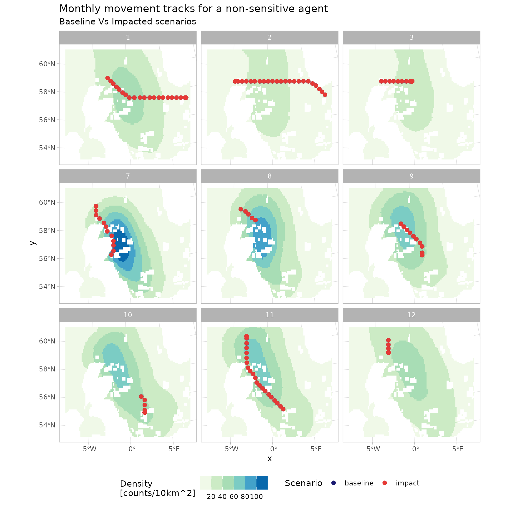

``` r
p_tracks <- guill_history |> 
  drop_na(timestamp) |> 
  filter(suscep == TRUE) |> 
  filter(agent == last(agent)) |> 
  ggplot() +
  stars::geom_stars(data = spec_imp_map) +
  geom_sf(aes(col = scenario), size = 2) +
  scale_colour_manual(values = c("#191970", "#E53935"), name = "Scenario") +
  scale_fill_fermenter(
    guide = "colourbar",
    palette = "GnBu", 
    na.value = "white",
    direction = 1,
    n.breaks = 8,
    name = "Density\n[counts/10km^2]"
  ) +
  facet_wrap(~month, ncol = 3) +
  labs(
    title = "Monthly movement tracks for a sensitive agent",
    subtitle = "Baseline Vs Impacted scenarios"
  ) +
  theme(legend.position = "bottom")

p_tracks
```

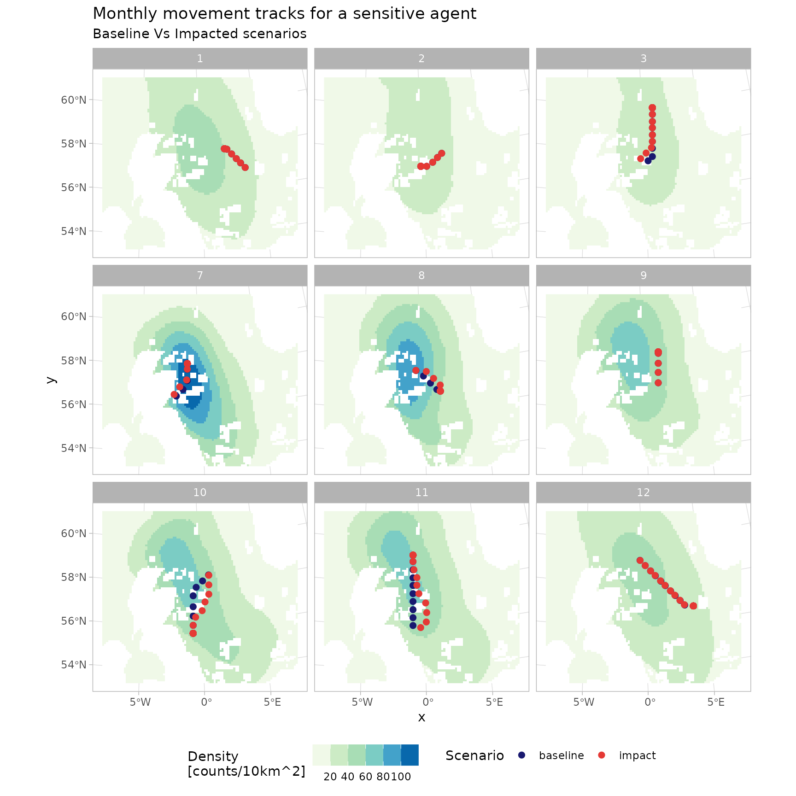

The figure below shows the movement of 250 agents over the full duration
of a simulation, for the same model configuration but with a larger
number of simulated agents. The animation depicts how agents’ movement
patterns are informed by the monthly density surfaces under the impacted
scenario, while also highlighting how individuals respond to the OWF
footprints as tolerated passage zones according to their assigned
susceptibility.

``` r
# Creating animation of movements for a sample of the simulation agents, under
# the impact scenario

# create copy of impacted density map, with March layer replicated as additional
# April layer for animation rendering purposes
dens_imp <- spec_imp_map
dens_imp_apr <- filter(dens_imp, month == 3) |>
  st_set_dimensions("month", values = 4)
dens_imp <- c(dens_imp, dens_imp_apr, along = "month")

# convert numeric months to Date, for consistency with history outputs
month_num <- st_get_dimension_values(dens_imp, "month")
dens_imp <- st_set_dimensions(
  dens_imp,
  which = "month",
  values = as.Date(sprintf("202%i-%i-01", ifelse(month_num <= 4, 6, 5), month_num)),
  names =  "Date"
)

# generate animation
anim <- guill_history_long |>
  drop_na(timestamp) |>
  filter(
    scenario == "impact",
    agent %in% unique(agent)[1:250]
  ) |>
  mutate(
    owf_sensitive = fct_rev(
      ifelse(owf_sensitive, "OWF Sensitive", "OWF Non-sensitive")
    )
  ) |>
  ggplot() +
  stars::geom_stars(data = dens_imp) +
  geom_sf(aes(col = owf_sensitive), size = 1.6, alpha = 0.3) +
  coord_sf(expand = FALSE) +
  scale_fill_fermenter(
    guide = "colourbar",
    palette = "GnBu", 
    na.value = "white",
    direction = 1,
    n.breaks = 8,
    name = "Density\n[counts/10km^2]"
  ) +
  scale_colour_manual(
    #values = c("#E53935", "#424242"),
    values = c("#EF6C00", "#6A1B9A"), 
    guide = guide_legend(position = "bottom", title = NULL)
  ) +
  transition_time(Date) +
  labs(
    title = "Impact Scenario", 
    subtitle = "Date: {frame_time}", 
    x = NULL, y = NULL
  )
```


### Use of counterfactals

Quantification of the impact of the perturbation can be done on any of
the defined agent condition (and/or history), but for consenting the
utility is through EIAs that likely use:

- Cumulative net energy
- Season-end body mass or mass change
- Distributions of activity/behavioural states
- Minimum body mass over the season
- Mortality

These are not single values, but distributions representing the
variability in the simulated populations. For example, the plots in the
next figure compare the distribution of end‑of‑simulation body masses
between paired baseline and impact runs, from an model re-run with 1000
agents. Most agents show reduced final body weights under the impacted
scenario, with the magnitude of this reduction slightly greater in
OWF‑susceptible individuals.

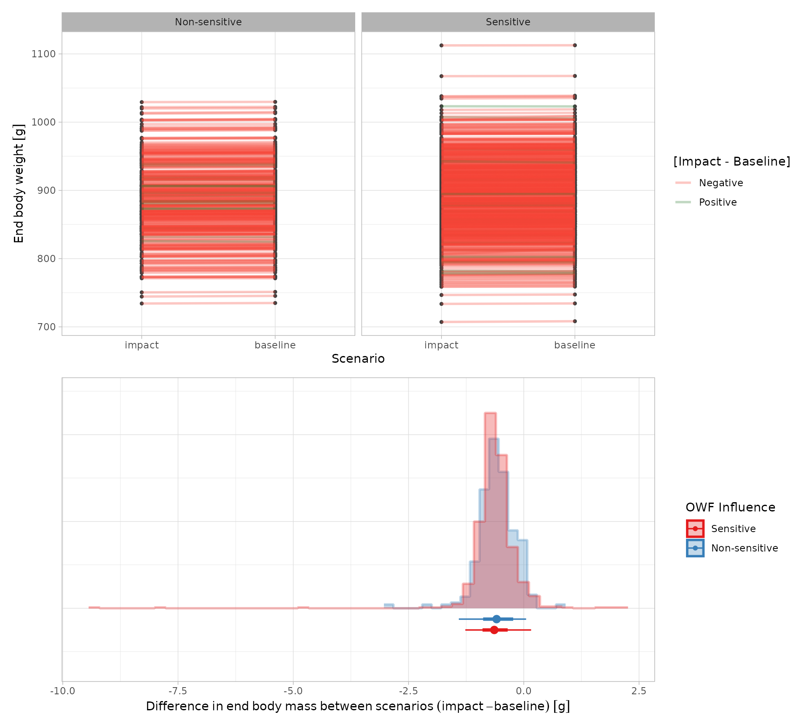

While being directly informative at a population level (e.g. the mean
%-age of the population lost), the output distributions are tangible for
down-stream calculations. The most obvious application being in
Population Viability Analyses (PVAs) that are frequently required in
EIAs for consenting. There the counterfactuals may use:

- Increases in mortality/proportional reductions in population size
- Relationships between body mass and reproductive success, to alter PVA
  demographic parameters

For example, Natural England provide an R PVA toolset here
[nepva](https://github.com/naturalengland/Seabird_PVA_Tool), frequently
used in consenting, where the distributions of productivity can be
specified under differing scenarios. The PVAs provide monte-carlo
simulations of projected population sizes, which are matched
(impact-to-baseline) to give population-level counterfactuals of
impacts. The DisNBS simulations can be used to estimate these
productivities.

## References

Buckingham, Lila, Maria I. Bogdanova, Jonathan A. Green, Ruth E. Dunn,
Sarah Wanless, Sophie Bennett, Richard M. Bevan, et al. 2022.
“Interspecific Variation in Non-Breeding Aggregation: A Multi-Colony
Tracking Study of Two Sympatric Seabirds.” *Marine Ecology Progress
Series* 684: 181–97. <https://doi.org/10.3354/meps13960>.

Buckingham, Lila, Francis Daunt, Maria I. Bogdanova, Robert W. Furness,
Sophie Bennett, James Duckworth, Ruth E. Dunn, et al. 2023. “Energetic
Synchrony Throughout the Non-Breeding Season in Common Guillemots from
Four Colonies.” *Journal of Avian Biology* 2023 (January).
<https://doi.org/10.1111/jav.03018>.

Dunn, Ruth E., Jonathan A. Green, Sarah Wanless, Mike P. Harris, Mark A
Newell, Maria I. Bogdanova, Catharine Horswill, Francis Daunt, and Jason
Matthiopoulos. 2022. “Modelling and Mapping How Common Guillemots
Balance Their Energy Budgets over a Full Annual Cycle.” *Functional
Ecology* 36 (July): 1612–26. <https://doi.org/10.1111/1365-2435.14059>.

Elliott, Kyle H., Robert E. Ricklefs, Anthony J. Gaston, Scott A. Hatch,
John R. Speakman, and Gail K. Davoren. 2013. “High Flight Costs, but Low
Dive Costs, in Auks Support the Biomechanical Hypothesis for
Flightlessness in Penguins.” *Proceedings of the National Academy of
Sciences of the United States of America* 110 (June): 9380–84.
<https://doi.org/10.1073/pnas.1304838110>.

Harris, MP, and S Wanless. 1988. “Measurements and Seasonal Changes in
Weight of Guillemots Uria Aalge at a Breeding Colony.” *Ringing &
Migration* 9 (1): 32–36.

Peschko, Verena, Henriette Schwemmer, Moritz Mercker, Nele Markones, Kai
Borkenhagen, and Stefan Garthe. 2024. “Cumulative Effects of Offshore
Wind Farms on Common Guillemots (Uria Aalge) in the Southern North Sea -
Climate Versus Biodiversity?” *Biodiversity and Conservation* 33
(March): 949–70. <https://doi.org/10.1007/s10531-023-02759-9>.

------------------------------------------------------------------------

1.  Under the density‑informed movement model, `prob` is forced to 1 at
    the initialization phase for the chosen baseline density driver

2.  The `furrr` package handles the parallelisation
