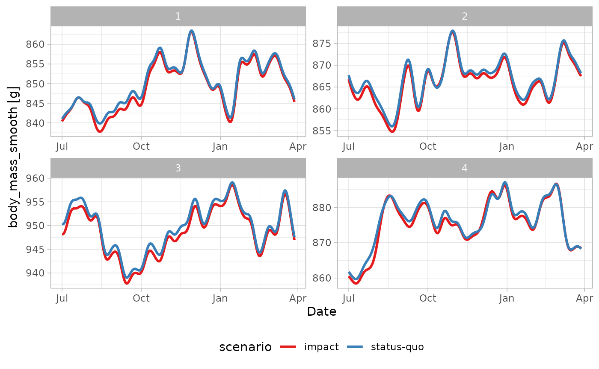
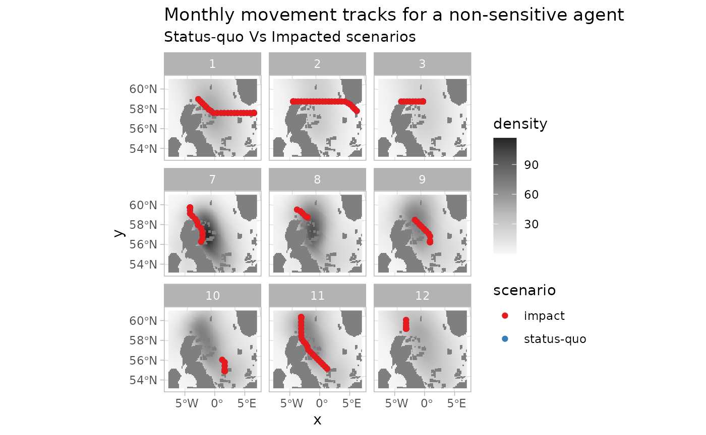
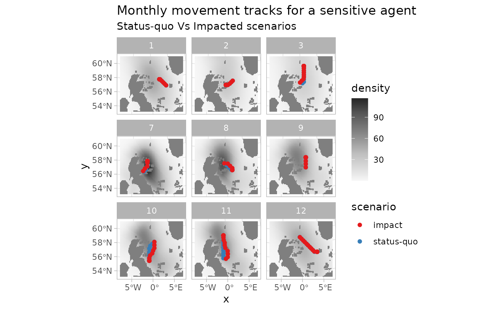

# Case Study: Isle of May's Guillemot

## Overview

Here we use roamR to simulate the movement and energetics for a
population of common guillemot (*Uria aalge*) on the Isle of May. For
broad-scale details on the roamR package, refer to the general guide,
with the general architecture repeated here:


The simulations here cover the non-breeding season (some 9 months, from
July to March) under two broad scenarios:

- An environment free of Offshore Windfarms (OWFs) - nominally the
  status quo
- An environment with many synthetic OWF developments


**Figure 2: Synthetic windfarms within North Sea, against a predicted
guillemot density surface. Density is clipped to the AoC, windfarms are
the light blue boxes. Anything beyond the AoC boundaries are excluded
from calculations**

The overall intention is to quantify the effects of potential
displacement from these developments, based on counterfactual
comparisons of animal’s condition under these scenarios. In keeping with
the architecture of the roamR package, the following main components
will be populated:

- **IBM general settings** (`<ModelConfig>`) sundry high-level controls
  for the simulation, such as the number of agents, broad spatial
  boundaries, spatial projections, time-steps, start & finish dates.
- **Species-level information** (`<Species>`) such as distributions
  governing initial body mass, what behavioural states are possible,
  movement parameters, and how agents respond to their environment
  e.g. avoidance of windfarms or landmass, costs associated with
  activity.
- **Drivers** (`<Driver>`) descriptions/data that define the environment
  that agents may interact with or respond to e.g. sea surface
  temperatures, locations of windfarms, coastlines, prey fields etc.

The extent to which these can be reliably populated will obviously vary,
with the guillemot chosen here as a population that is relatively well
studied. roamR is intentionally general and has substantial
functionality that will not be used in a simulation. We will populate
various elements of the simulation in turn, before turning to running
the simulation and post-processing the results.

## Input data

As a relatively well-studied species/population, there are many roamR
elements to populate. Mainly these are:

- Density maps
- SST
- Activity data
- Energetics
- Bodyweight
- body mass conversion

which will be a) described in detail and b) specified in roamR forms in
the following sections. roamR can be run with very little data (an
example of a more data sparse species is given in the alternative test
case of red-throated divers), with the results being correspondingly
less informative and more stochastic.

### IBM configuration

The broad configuration of the IBM is specified via the function
[`ModelConfig()`](https://dmpstats.github.io/roamR/reference/ModelConfig.md).In
the interest of speed, the example simulation here will not be large in
terms of the number of agents to run - we’ll opt for few agents
(`n_agents`), whereas a typical run would be 1000s. The non-breeding
season for these animals runs from approximately start of July for 9
months (`start_date`, `end_date`). We’ll opt for a uniform 1km^2 spatial
resolution (`x_delta`, `y_delta`) and have everything operate on the UTM
30N coordinate system (`ref_sys`). This will be the basis of ingesting
and aligning the general spatial inputs. Note: the package currently
requires all spatial inputs (e.g. density maps) to be provided in a
common Coordinate Reference System (CRS) [¹](#fn1). The
[sf](https://r-spatial.github.io/sf/) package is generally used for
dealing with spatial data (and the interlinked
[stars](https://r-spatial.github.io/stars/) package for spatiotemporal).

``` r
# Set UTM zone 30N
utm30 <- st_crs(32630)
```

Agent start and end locations (`start_sites`, `end_sites`) must be
supplied as`sf` objects containing two required columns: `id` (a unique
site identifier) and `prop` (the proportion of agents assigned to each
site).

In this example, we use the Isle of May as the sole starting location,
specified by its geographic coordinates (longitude/latitude). Note that
`end_sites` is not utilised in this the simulation, meaning the movement
model assumes agents remain at their final locations once the simulation
ends. As noted earlier, the site must be re-projected to the common UTM
Zone 30N coordinate reference system.

``` r
# location of colony in long/lat degrees - start/finish locations
isle_may <- st_sf(
  id = "Isle of May",
  prop = 1,
  geom = st_sfc(st_point(c(-2.5667, 56.1833))),
  crs = 4326) 

# re-project to UTM 30N
isle_may <- st_transform(isle_may, crs = utm30)
```

In terms of bounding the entire simulation spatially, we’ve opted for a
semi-arbitrary bounding box around the Isle of May that encompasses a
large swathe of the North Sea and far to the west of the UK, which
covers the bulk of the guillemot density maps. Note this a hard boundary
in terms of simulations - data outside this will have no influence.

``` r

AoC <- st_bbox(c(xmin = 178831, ymin = 5906535,  xmax = 1174762, ymax = 6783609), crs = st_crs(utm30))
```

Passing the above configuration inputs to
[`ModelConfig()`](https://dmpstats.github.io/roamR/reference/ModelConfig.md)
creates a `<ModelConfig>` object, which we assigned to
`guill_ibm_config`:

``` r

# IBM Settings - assume fixed for these simulations

guill_ibm_config <- ModelConfig(
  n_agents = 4,
  ref_sys = utm30,
  aoc_bbx = AoC, 
  delta_x = 1000,
  delta_y = 1000,
  delta_time = "1 day",
  start_date = date("2025-07-01"),
  end_date = date("2025-07-01") + 270, 
  start_sites = isle_may
)

class(guill_ibm_config)
#> [1] "ModelConfig"
#> attr(,"package")
#> [1] "roamR"
```

### Driver information - specifying the environment

Drivers define the environment that agents may interact with or respond,
with each driver being specified via the
[`Driver()`](https://dmpstats.github.io/roamR/reference/Driver.md)
function. The scope of these will be defined by the level of knowledge
for the species in hand - at the minimum the agents would not be
responsive to the environment. Any environmental component that can/will
be functionally linked to the animal’s behaviour (activity states or
movement) or their energetics, must be included in the definition of the
environment via the drivers.

In this application to the common guillemot, the following drivers are
required - all provided as spatio-temporal datacubes (2D rasters giving
values for $x,y$ locations over $t$ times) so the agents can query their
environment at any $x,y,t$:

- Monthly species density surfaces, for both baseline and impacted
  scenarios (Buckingham et al. (2023)). These give monthly density
  predictions around the UK at a 10 sq-km resolution (with bootstrap
  uncertainties).
- Monthly energy intake maps (kJ/h), for both baseline and impacted
  scenarios based on density maps above, and conspecifics (other
  Guillemots, refer below).
- Monthly average Sea Surface Temperature (SST) maps (National Oceanic
  and Atmospheric Administration/NOAA
  [here](https://downloads.psl.noaa.gov/Datasets/noaa.oisst.v2.highres/)).

roamR enforces a strict requirement that all input variables be
accompanied by appropriate measurement units. This ensures that all
computations performed during simulation are unit-aware, allowing for
accurate operations and conversions.

We begin by uploading these datacubes, assigning measurement units where
they are missing.

``` r
# driver spatial surfaces

spec_map <- readRDS("data/bioss_spec_map.rds") |> 
   mutate(density =  units::set_units(density, "counts"))

spec_imp_map <- readRDS("data/bioss_spec_imp_map.rds") |> 
   mutate(density =  units::set_units(density, "counts"))

intake_map <- readRDS("data/guill_energy_intake_map.rds")

imp_intake_map <- readRDS("data/guill_impacted_energy_intake_map.rds")

sst_map <- readRDS("data/bioss_sst_stars.rds") |> 
  mutate(sst =  units::set_units(sst, "degree_Celsius")) |> 
  stars::st_warp(crs = sf::st_crs(spec_map), threshold  = 20028)
```

Next we specify the corresponding drivers, and stored the as a list of
`<Driver>` objects. Collectively these define the environment the agents
will move through. This is very flexible, and can comprise of coastal
polygons, OWF footprints, prey-fields etc. Here we’re providing sea
surface temperature animal density surfaces, and maps that reflect the
energy Note here we’re adopting the *density-informed* movement model
(refer guidance document) which uses density maps for location
preference. The feasible locations are defined by the density surfaces
(so coast is implicit), and OWF are similarly implicit in the “impact”
density surfaces, where OWF-sensitive agents avoid developments.

Here the energetics maps reflect an Ideal Free Distribution (IFD) in the
unimpacted case i.e. the agent’s energy requirements are met on
average - their distribution reflects the underlying resource. The
impacted energy maps reflect displacement from the OWF footprints,
including the conspecifics, meaning a proportional reduction in the IFD
due to competition from other guillemot e.g. twice as many individuals
means 1/2 the resource.

``` r
# Set up IBM drivers 

dens_drv <- Driver(
  id = "dens",
  type = "resource",
  descr = "species dens map",
  stars_obj = spec_map,
  obj_active = "stars"
)

dens_imp_drv <- Driver(
  id = "dens_imp",
  type = "resource",
  descr = "species redist map",
  stars_obj = spec_imp_map,
  obj_active = "stars"
)

energy_drv <- Driver(
  id = "energy",
  type = "resource",
  descr = "energy map",
  stars_obj = intake_map,
  obj_active = "stars"
)

imp_energy_drv <- Driver(
  id = "imp_energy",
  type = "resource",
  descr = "energy impact map",
  stars_obj = imp_intake_map,
  obj_active = "stars"
)


sst_drv <- Driver(
  id = "sst",
  type = "habitat",
  descr = "Sea Surface Temperature",
  stars_obj = sst_map,
  obj_active = "stars"
)


# store as list for initialisation
guill_drivers <- list(
  dens = dens_drv,
  imp_dens = dens_imp_drv,
  energy = energy_drv,
  imp_energy = imp_energy_drv,
  sst = sst_drv
)
```

### Species information - properties that inform individual agents

Species-level information is defined using the
[`Species()`](https://dmpstats.github.io/roamR/reference/Species.md)
function, which depends on a set of input objects. For clarity and
modularity, these inputs should be prepared and specified beforehand.

#### States Profile

We begin by defining the behavioural states to include in the model.
Each state represents a specific activity, characterized by parameters
such as energy expenditure, time allocation, and movement speed.

States are created using the
[`State()`](https://dmpstats.github.io/roamR/reference/State.md)
function. roamR supports flexible specification of state properties,
allowing the incorporation of stochastic variation at both the
population and individual (agent) level.

Here we include 4 states:

- flying
- diving
- active on water (i.e. swimming)
- inactive on water (i.e. resting)

We start with the ‘flight’ state. For the current simulation, we assume
the energetic cost of flying for each agent varies throughout the
simulation, following a Normal distribution with mean `507.6 kJ/h` and
standard deviation of`237.6 kJ/h`. The source for these figures are
Elliott et al. (2013).

Stochasticity can enter in various ways, here we specify the average
speed of each agent to be fixed over the simulation (e.g. we’re implying
relatively fast/slow animals), with agents speeds drawn from a uniform
distribution, as specified below.

``` r
# user-defined function returning the energy cost of flying
flight_cost_fn <- function(mean, sd){
  e <- rnorm(1, mean, sd)
  (max(e, 1)) |>
    units::set_units("kJ/h")
}

flight <- State(
  id = "flight", 
  energy_cost = VarFn(
    flight_cost_fn, 
    args_spec = list(mean = 507.6, sd = 237.6), 
    units = "kJ/hour"
    ), 
  time_budget = VarDist(0.056, "hours/day"), 
  speed = VarDist(dist_uniform(10, 20), "m/s")
)
```

The state representing the ‘diving’ activity (Elliott et al. 2013) as
energy output contingent on the amount of diving. Here we are performing
day-level calculations, meaning we are far from simulating at the dive
level, and can use a mean dive-length without loss of generality. This
is `t_dive` and populated later from tag information.

$$e = 3.71\frac{\sum\limits_{i}\left( 1 - e^{- T_{i}/1.23} \right)}{\sum\limits_{i}T_{i}}$$

Where $T_{i}$ is the dive length of dive $i$ in minutes.

``` r
# define costing function
dive_cost_fn <- function(t_dive, alpha_mean, alpha_sd){
  alpha <- rnorm(1, alpha_mean, alpha_sd)
  (max(alpha*sum(1-exp(-t_dive/1.23))/sum(t_dive)*60, 1)) |>
    units::set_units("kJ/h")
}


# Construct <State> object
dive <- State(
  id = "diving", 
  energy_cost = VarFn(
    dive_cost_fn, 
    args_spec = list(t_dive = 1.05, alpha_mean = 3.71, alpha_sd = 1.3), 
    units = "kJ/hour"
    ), 
  time_budget = VarDist(3.11, "hours/day"), 
  speed = VarDist(dist_uniform(0, 1), "m/s")
)
```

State representing ‘active on water’ (Buckingham et al. 2023) is a
linear function in SST:

$$e = a - (b*SST)$$

where $a$ has a mean of 113 and SD of 22. $b$ is a constant of 2.75.

``` r

active_water_cost_fn <- function(sst, int_mean, int_sd){
  int <- rnorm(1, int_mean, int_sd)
  (max(int-(2.75*sst), 1)) |>
    units::set_units("kJ/h")
}


# Construct <State> object
active <- State(
  id = "active_on_water", 
  energy_cost = VarFn(
    active_water_cost_fn, 
    args_spec = list(sst = "driver", int_mean = 113, int_sd = 22), 
    units = "kJ/hour"
  ), 
  time_budget = VarDist(10.5, "hours/day"), 
  speed = VarDist(dist_uniform(0, 1), "m/s")
)
```

State for ‘inactive on water’ (Buckingham et al. 2023), follows the same
linear function in SST, but where $a$ has a mean of 72.2 and SD of 22.
$b$ is similarly constant at 2.75.

``` r

inactive_water_cost_fn <- function(sst, int_mean, int_sd){
  int <- rnorm(1, int_mean, int_sd)
  (max(int-(2.75*sst), 1)) |>
    units::set_units("kJ/h")
}


inactive <- State(
  id = "inactive_on_water", 
  energy_cost = VarFn(
    active_water_cost_fn, 
    args_spec = list(sst = "driver", int_mean = 72.2, int_sd = 22), 
    units = "kJ/hour"
  ), 
  time_budget = VarDist(10.3, "hours/day"), 
  speed = VarDist(dist_uniform(0, 1), "m/s")
)
```

These are combined to give a list covering all states: `guill_states`:

``` r
guill_states <- list(
  flight = flight,
  dive = dive,
  active = active,
  inactive = inactive
)
```

#### Driver Responses

In this section, we define species-level, agent-specific responses to
the environmental drivers introduced and defined earlier. For the
guillemot model, we assign the density drivers - identified as `"dens"`
(baseline) and `"dens_imp"` (impacted) - as the primary determinants of
agent movement (density maps as per Buckingham et al. (2022)). For each
scenario, we also specify the probability that an agent is influenced by
the respective driver. In the baseline case, all agents “respond” to the
density map for their movement. For driver `"dens_imp"`, this
probability reflects how likely an agent is to respond to a OWF
installation (Peschko et al. 2024) - hence their influence map differs.

``` r

resp_dens <- DriverResponse(
  driver_id = "dens",
  movement = MoveInfluence(
    prob = VarDist(distributional::dist_degenerate(1)),
    type = "attraction",
    mode = "cell-value",
    sim_stage = "bsln"
  )
)

resp_imp_dens <- DriverResponse(
  driver_id = "dens_imp",
  movement = MoveInfluence(
    prob = VarDist(distributional::dist_normal(0.67, sd = 0.061)),
    type = "attraction",
    mode = "cell-value",
    sim_stage = "imp"
  )
)
```

#### Create the `<Species>` object

In addition to the parameters defined above, we set the remaining
species-level properties, including the body mass distribution (used to
initialise each agent’s body mass) and the energy-to-mass conversion
rate (Dunn et al. 2022), which is assumed constant across agents and
simulated time steps. The distribution of body mass at start of breeding
season was drawn/inferred from Harris and Wanless (1988) (with
additional advice from F. Daunt, *pers. comm.*, 2025) .

``` r
guill <- Species(
  id = "guill",
  common_name = "guillemot",
  scientific_name = "Uria Aalge",
  body_mass_distr = VarDist(dist_normal(mean = 929, sd = 56), "g"),
  energy_to_mass_distr = VarDist(0.072, "g/kJ"),
  states_profile = guill_states,
  driver_responses = list(resp_dens, resp_imp_dens)
)
```

## Setting up and running the IBM

Now the key components of the IBM have been specified, roamR can be used
for the initialisation and running of the simulations.

### Initialisation

The initialisation stage performs two main tasks prior to running:

- The checking of inputs for conformity, some adjustments (e.g. clipping
  to the AoC) and derivation of of vector fields where needed.
- The generation the `n_agents` as indicated in the model config object.

``` r

set.seed(1009)

guill_ibm <- xfun::cache_rds({
  rmr_initiate(
  model_config = guill_ibm_config,
  species = guill,
  drivers = guill_drivers
)

})
#> ℹ Validating inputs
#> ✔ Validating inputs [100ms]
#> 
#> ℹ Cropping drivers to AOC
#> ✔ Cropping drivers to AOC [51ms]
#> 
#> ℹ Processing Activity States
#> ✔ Processing Activity States [25ms]
#> 
#> ℹ Initialize Agents
#> ✔ Initialize Agents [223ms]
#> 
#> ℹ Initialize <IBM> object
#> ✔ Initialize <IBM> object [16ms]
#> 
#> ✔ Initialization Done! 🚀
```

### Running the simulation

The running of the simulation involves moving each of the initialised
agents through the defined environment, with monitoring of their
condition through time and determining their responses to these.
Parallelisation is dealt with (and assumed to be generally used) such
that individual agents are piped out to independent threads of
calculation - hence the speed of a simulation is a function of the
number of cores available[²](#fn2).

Much of the parameterisiation and data from previous sections are
encapsulated within the `ibm` object (`guill_ibm`) passed to the
simulation. Several additional parameters as per documentation can be
entered here as needed. Here we specify:

- What state(s) are feeding states or resting states - the
  state-balancing calculations (refer to main documentation) will
  increase/decrease these as required
- `feed_avg_net_energy` the average net energy per unit feeding - here a
  tuning parameter, calculable directly as the energy required to
  balance the energetics equations for an average agent.
- `target_energy` the objective of the state rebalancing in terms of
  daily energy (refer to main documentation). This controls the extent
  agents change their feeding behaviour in response to feeding success -
  low success means more feeding the following day. This is expressed as
  a target daily net energy, which here is a modest positive value,
  based on empirical results of body mass at the start and end of the
  non-breeding season (*pers. comm.* F. Daunt 2025).
- `smooth_body_mass` a use-defined function to convert energy
  time-series to mass. Here mass deposition occurs as a function of the
  preceding 7 days energy intake (*pers. comm.* J. Green, 2025).

``` r


plan(multisession, workers = 2)

guill_results <- xfun::cache_rds({
  run_disnbs(
  ibm = guill_ibm,
  run_scen = "baseline-and-impact", 
  dens_id = "dens", 
  intake_id = "energy", 
  imp_dens_id = "dens_imp", 
  imp_intake_id = "imp_energy", 
  feed_state_id = "diving", 
  roost_state_id = "inactive_on_water", 
  feed_avg_net_energy = units::set_units(422, "kJ/h"), 
  target_energy = units::set_units(1, "kJ"), 
  smooth_body_mass = bm_smooth_opts(time_bw = "7 days"), 
  waypnts_res = 1000, 
  seed = 1990
)

})
#> 
#> ── Running the DisNBS Individual-Based Model ───────────────────────────────────
#> ℹ Performing validation checks on inputs and underlying data.
#> ✔ Performing validation checks on inputs and underlying data. [21ms]
#> 
#> ℹ Preparing and configuring data for simulation.
#> ✔ Preparing and configuring data for simulation. [191ms]
#> 
#> ℹ Simulating agents' journeys under the baseline-case scenario
#> ✔ Simulating agents' journeys under the baseline-case scenario [18.1s]
#> 
#> ℹ Simulating agents' journeys under the impact-case scenario
#> ✔ Simulating agents' journeys under the impact-case scenario [15.7s]
#> 
#> ✔ Model simulation finished! 🛬

plan(sequential)
```

## Digesting the results

roamR records an extensive amount of information from its running and
monitoring of the agents. The primary output is a list, with one element
for each agent. The stored agents consist of three main components (each
their own class, as per the package schema):

- `properties` - were drawn/set at the intialisation of the simulation
  from the species definition, remain constant throughout
- `condition` - the specific condition of the agent at any point in the
  simulation. This will be the final condition at when the simulation
  completes.
- `history` - a detailed record of elements of the agent’s condition
  throughout the simulation. Spatiotemporally stamped, and includes
  post-processed energy-to-mass conversions.

These form the basis of any downstream calculations based on the
simulation outputs. When there are impact scenarios in play, there will
be more than one such list, with agents paired over the impact scenarios
e.g. baseline versus impact.

We can examine the agent’s simulation histories directly - here we have
two scenarios, each containing a number of agents:

``` r
# two scenarios
  names(guill_results)
#> [1] "agents_bsln" "agents_imp"

# several agents within each
  length(guill_results$agents_bsln)
#> [1] 4

# one agents history
str(guill_results$agents_bsln[[1]]@history)
#> Classes 'sf' and 'data.frame':   272 obs. of  15 variables:
#>  $ timestep                          : int  0 1 2 3 4 5 6 7 8 9 ...
#>  $ timestamp                         : POSIXct, format: NA "2025-07-01" ...
#>  $ track_id                          : int  0 1 1 1 1 1 1 1 1 1 ...
#>  $ body_mass                         : Units: [g] num  893 843 824 860 787 ...
#>  $ body_mass_smooth                  : Units: [g] num  NA 841 841 842 842 ...
#>  $ states_budget.flight              : num  0.00234 0.0025 0.00243 0.00257 0.00229 ...
#>  $ states_budget.diving              : num  0.1298 0.0677 0.0941 0.0444 0.1454 ...
#>  $ states_budget.active_on_water     : num  0.438 0.469 0.456 0.481 0.43 ...
#>  $ states_budget.inactive_on_water   : num  0.43 0.46 0.447 0.472 0.422 ...
#>  $ states_unit_cost.flight           : Units: [kJ/h] num  0 -326 -580 -268 -380 ...
#>  $ states_unit_cost.diving           : Units: [kJ/h] num  0 -176.8 -210.4 -138.4 -87.9 ...
#>  $ states_unit_cost.active_on_water  : Units: [kJ/h] num  0 -108.2 -100.6 -76.2 -118.9 ...
#>  $ states_unit_cost.inactive_on_water: Units: [kJ/h] num  0 -64.9 -29.3 -47.7 -49.5 ...
#>  $ energy_expenditure                : Units: [kJ] num  0 -684 -952 -449 -1472 ...
#>  $ geometry                          :sfc_POINT of length 272; first list element:  'XY' num  526896 6226565
#>  - attr(*, "sf_column")= chr "geometry"
#>  - attr(*, "agr")= Factor w/ 3 levels "constant","aggregate",..: NA NA NA NA NA NA NA NA NA NA ...
#>   ..- attr(*, "names")= chr [1:14] "timestep" "timestamp" "track_id" "body_mass" ...
```

### Comparing scenarios

Here we extract the history from agents under the two scenarios for
comparison. All agents over both scenarios are combined into one
dataset.

    #> Simple feature collection with 2176 features and 19 fields
    #> Geometry type: POINT
    #> Dimension:     XY
    #> Bounding box:  xmin: 363772.8 ymin: 5958868 xmax: 1143527 ymax: 6743622
    #> Projected CRS: WGS 84 / UTM zone 30N
    #> First 10 features:
    #>      scenario agent timestep  timestamp track_id    body_mass body_mass_smooth
    #> 1  status-quo     1        0       <NA>        0 892.7471 [g]           NA [g]
    #> 2  status-quo     1        1 2025-07-01        1 843.4863 [g]     841.0222 [g]
    #> 3  status-quo     1        2 2025-07-02        1 824.1961 [g]     841.3407 [g]
    #> 4  status-quo     1        3 2025-07-03        1 860.4239 [g]     841.6555 [g]
    #> 5  status-quo     1        4 2025-07-04        1 786.7908 [g]     841.9606 [g]
    #> 6  status-quo     1        5 2025-07-05        1 899.6028 [g]     842.2460 [g]
    #> 7  status-quo     1        6 2025-07-06        1 851.8596 [g]     842.5069 [g]
    #> 8  status-quo     1        7 2025-07-07        1 797.9183 [g]     842.7435 [g]
    #> 9  status-quo     1        8 2025-07-08        1 860.3766 [g]     842.9635 [g]
    #> 10 status-quo     1        9 2025-07-09        1 844.7294 [g]     843.1735 [g]
    #>    states_budget.flight states_budget.diving states_budget.active_on_water
    #> 1           0.002336644           0.12976717                     0.4381207
    #> 2           0.002503428           0.06765173                     0.4693928
    #> 3           0.002432399           0.09410517                     0.4560748
    #> 4           0.002565795           0.04442471                     0.4810865
    #> 5           0.002294667           0.14540035                     0.4302501
    #> 6           0.002685079           0.00000000                     0.5034522
    #> 7           0.002534260           0.05616915                     0.4751738
    #> 8           0.002335640           0.13014076                     0.4379326
    #> 9           0.002565621           0.04448955                     0.4810539
    #> 10          0.002508006           0.06594702                     0.4702511
    #>    states_budget.inactive_on_water states_unit_cost.flight
    #> 1                        0.4297755           0.0000 [kJ/h]
    #> 2                        0.4604520        -326.0301 [kJ/h]
    #> 3                        0.4473876        -580.4143 [kJ/h]
    #> 4                        0.4719230        -267.6850 [kJ/h]
    #> 5                        0.4220549        -380.0569 [kJ/h]
    #> 6                        0.4938627        -540.9809 [kJ/h]
    #> 7                        0.4661228        -458.9594 [kJ/h]
    #> 8                        0.4295910        -452.3054 [kJ/h]
    #> 9                        0.4718909        -173.1052 [kJ/h]
    #> 10                       0.4612939        -818.3772 [kJ/h]
    #>    states_unit_cost.diving states_unit_cost.active_on_water
    #> 1           0.00000 [kJ/h]                   0.00000 [kJ/h]
    #> 2        -176.78357 [kJ/h]                -108.17686 [kJ/h]
    #> 3        -210.44304 [kJ/h]                -100.59187 [kJ/h]
    #> 4        -138.40550 [kJ/h]                 -76.24058 [kJ/h]
    #> 5         -87.91532 [kJ/h]                -118.91570 [kJ/h]
    #> 6         -90.63622 [kJ/h]                -132.35904 [kJ/h]
    #> 7         -87.63698 [kJ/h]                 -34.04614 [kJ/h]
    #> 8         -66.87361 [kJ/h]                -123.85927 [kJ/h]
    #> 9        -178.81558 [kJ/h]                 -91.25478 [kJ/h]
    #> 10       -142.40802 [kJ/h]                 -84.17964 [kJ/h]
    #>    states_unit_cost.inactive_on_water energy_expenditure       Date month
    #> 1                     0.000000 [kJ/h]       0.00000 [kJ]       <NA>    NA
    #> 2                   -64.856872 [kJ/h]    -684.17668 [kJ] 2025-07-01     7
    #> 3                   -29.316059 [kJ/h]    -952.09712 [kJ] 2025-07-02     7
    #> 4                   -47.738181 [kJ/h]    -448.93350 [kJ] 2025-07-03     7
    #> 5                   -49.479257 [kJ/h]   -1471.61472 [kJ] 2025-07-04     7
    #> 6                    -8.571322 [kJ/h]      95.21804 [kJ] 2025-07-05     7
    #> 7                   -10.708986 [kJ/h]    -567.88115 [kJ] 2025-07-06     7
    #> 8                   -46.383505 [kJ/h]   -1317.06559 [kJ] 2025-07-07     7
    #> 9                   -59.964954 [kJ/h]    -449.59019 [kJ] 2025-07-08     7
    #> 10                   -6.390341 [kJ/h]    -666.91142 [kJ] 2025-07-09     7
    #>    suscep                 geometry
    #> 1   FALSE POINT (526895.8 6226565)
    #> 2   FALSE POINT (543716.2 6248777)
    #> 3   FALSE POINT (543716.2 6248777)
    #> 4   FALSE POINT (543716.2 6248777)
    #> 5   FALSE POINT (543716.2 6248777)
    #> 6   FALSE POINT (543716.2 6248777)
    #> 7   FALSE POINT (543716.2 6248777)
    #> 8   FALSE POINT (543716.2 6248777)
    #> 9   FALSE POINT (543716.2 6248777)
    #> 10  FALSE POINT (543716.2 6248777)

#### body mass traces

We can examine a small number of agents graphically - here their body
mass histories as implied by the simulated energetics. Note roamR at its
heart simulates energetics, so conversion functions from energy to mass
are specified by the user. Here the primary conversion figure is from
Dunn et al. (2022), relating energy to grams of body mass.

``` r

p_bdm <- guill_history |> 
  ggplot() +
  geom_line(aes(x = Date, y = body_mass_smooth, col = scenario), linewidth = 1) +
  scale_color_brewer(palette = "Set1") +
  theme(legend.position = "bottom") +
  facet_wrap(~agent, ncol = 2, scales = "free")
  
p_bdm
```



``` r

ggsave("images/body mass.png", p_bdm, width = 12, height = 12)
  
```

#### Agent tracks

Similarly movement tracks for select agents over time can be visualised,
under the two impact scenarios. Here we separate by a property of the
agent - those that were assigned susceptibility to OWF in the agent
initialisation - recalling this was a stochastic specification at the
species level.

``` r

p_tracks <- guill_history |> 
  drop_na(timestamp) |> 
  filter(suscep == FALSE) |> 
  filter(agent == last(agent)) |> 
  ggplot() +
  stars::geom_stars(data = spec_imp_map) +
  geom_sf(aes(col = scenario)) +
  scale_color_brewer(palette = "Set1") +
  scale_fill_distiller(palette = "Greys", direction = 1) +
  facet_wrap(~month, ncol = 3) +
  labs(title = "Monthly movement tracks for a non-sensitive agent", subtitle = "Status-quo Vs Impacted scenarios")
  
p_tracks
```



``` r

ggsave("images/tracks_non_susceptile_agent.png", p_tracks, width = 15, height = 15)
```

``` r

p_tracks <- guill_history |> 
  drop_na(timestamp) |> 
  filter(suscep == TRUE) |> 
  filter(agent == last(agent)) |> 
  ggplot() +
  stars::geom_stars(data = spec_imp_map) +
  geom_sf(aes(col = scenario)) +
  scale_color_brewer(palette = "Set1") +
  scale_fill_distiller(palette = "Greys", direction = 1) +
  facet_wrap(~month, ncol = 3) +
  labs(title = "Monthly movement tracks for a sensitive agent", subtitle = "Status-quo Vs Impacted scenarios")

p_tracks
```



``` r

ggsave("images/tracks_susceptile_agent.png", p_tracks, width = 15, height = 15)
```

### Use of counterfactals

Quantification of the impact of the perturbation can be done on any of
the defined agent condition (and/or history), but for consenting the
utility is through EIAs that likely use:

- Cumulative net energy
- Season-end body mass or mass change
- Distributions of activity/behavioural states
- Minimum body mass over the season
- Mortality

These are not single values, but distributions representing the
variability in the simulated populations. While being directly
informative at a population level (e.g. the mean %-age of the population
lost), the distributions are tangible for down-stream calculations. The
most obvious application being in Population Viability Analyses (PVAs)
that are frequently required in EIAs for consenting. There the
counterfactuals may use:

- Increases in mortality/proportional reductions in population size
- Relationships between body mass and reproductive success, to alter PVA
  demographic parameters

For example, Natural England provide an R PVA toolset here
[nepva](https://github.com/naturalengland/Seabird_PVA_Tool), frequently
used in consenting, where the distributions of productivity can be
specified under differing scenarios. The PVAs provide monte-carlo
simulations of projected population sizes, which are matched
(impact-to-baseline) to give population-level counterfactuals of
impacts. The DisNBS simulations can be used to estimate these
productivities.

## References

Buckingham, Lila, Maria I. Bogdanova, Jonathan A. Green, Ruth E. Dunn,
Sarah Wanless, Sophie Bennett, Richard M. Bevan, et al. 2022.
“Interspecific Variation in Non-Breeding Aggregation: A Multi-Colony
Tracking Study of Two Sympatric Seabirds.” *Marine Ecology Progress
Series* 684: 181–97. <https://doi.org/10.3354/meps13960>.

Buckingham, Lila, Francis Daunt, Maria I. Bogdanova, Robert W. Furness,
Sophie Bennett, James Duckworth, Ruth E. Dunn, et al. 2023. “Energetic
Synchrony Throughout the Non-Breeding Season in Common Guillemots from
Four Colonies.” *Journal of Avian Biology* 2023 (January).
<https://doi.org/10.1111/jav.03018>.

Dunn, Ruth E., Jonathan A. Green, Sarah Wanless, Mike P. Harris, Mark A
Newell, Maria I. Bogdanova, Catharine Horswill, Francis Daunt, and Jason
Matthiopoulos. 2022. “Modelling and Mapping How Common Guillemots
Balance Their Energy Budgets over a Full Annual Cycle.” *Functional
Ecology* 36 (July): 1612–26. <https://doi.org/10.1111/1365-2435.14059>.

Elliott, Kyle H., Robert E. Ricklefs, Anthony J. Gaston, Scott A. Hatch,
John R. Speakman, and Gail K. Davoren. 2013. “High Flight Costs, but Low
Dive Costs, in Auks Support the Biomechanical Hypothesis for
Flightlessness in Penguins.” *Proceedings of the National Academy of
Sciences of the United States of America* 110 (June): 9380–84.
<https://doi.org/10.1073/pnas.1304838110>.

Harris, MP, and S Wanless. 1988. “Measurements and Seasonal Changes in
Weight of Guillemots Uria Aalge at a Breeding Colony.” *Ringing &
Migration* 9 (1): 32–36.

Peschko, Verena, Henriette Schwemmer, Moritz Mercker, Nele Markones, Kai
Borkenhagen, and Stefan Garthe. 2024. “Cumulative Effects of Offshore
Wind Farms on Common Guillemots (Uria Aalge) in the Southern North Sea -
Climate Versus Biodiversity?” *Biodiversity and Conservation* 33
(March): 949–70. <https://doi.org/10.1007/s10531-023-02759-9>.

------------------------------------------------------------------------

1.  functionality to homogenise CRSs across spatial inputs during model
    initialization is expected to be implemented in roamR in the near
    future

2.  The `furrr` package handles the parallelisation
