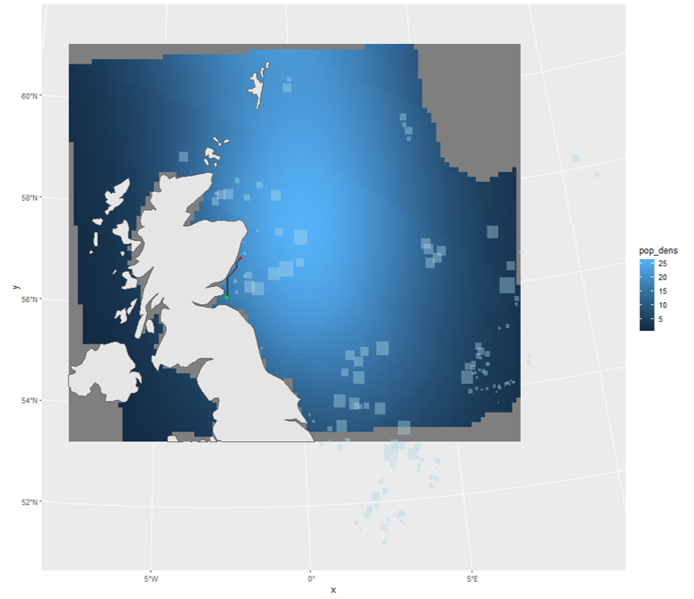

```{r, include = FALSE}
knitr::opts_chunk$set(
  collapse = TRUE,
  comment = "#>",
  warning = FALSE 
)
```

```{r setup, include=FALSE}
# install.packages("pak")
# pak::pkg_install("dmpstats/roamR")

library(roamR)
library(sf)
library(tidyverse)
library(distributional)
library(stars)
library(FNN) # dependency for stars::st_warp()
library(future)
library(units)

theme_set(theme_light())
```

# Overview
Here we use `{roamR}` to simulate the movement and energetics for a population of common guillemot (_Uria aalge_) on the Isle of May. For broad-scale details on the `{roamR}` package, refer to the general guide, with the general architecture repeated here:


The simulations here cover the non-breeding season (some 9 months, from July to March) under two broad scenarios:

* An environment free of Offshore Windfarms (OWFs) - nominally the status quo
* An environment with many synthetic OWF developments 





The overall intention is to quantify the effects of potential displacement from these developments, based on counterfactual comparisons of animal's condition under these scenarios. In keeping with the architecture of the `{roamR}` package, the following main components will be populated:

* __IBM general settings__ (`<ModelConfig>`) sundry high-level controls for the simulation, such as the number of agents, broad spatial boundaries, spatial projections, time-steps, start & finish dates.
* __Species-level information__ (`<Species>`) such as distributions governing initial body mass, what behavioural states are possible, movement parameters, and how agents respond to their environment e.g.  avoidance of windfarms or landmass, costs associated with activity.
* __Drivers__ (`<Driver>`) descriptions/data that define the environment that agents may interact with or respond to e.g. sea surface temperatures, locations of windfarms, coastlines, prey fields etc.

The extent to which these can be reliably populated will obviously vary, with the guillemot chosen here as a population that is relatively well studied. `{roamR}`
is intentionally general and has substantial functionality that will not be used in a simulation. We will populate various elements of the simulation in turn, before turning to running the simulation and post-processing the results.


# Input data

As a relatively well-studied species/population, there are many `{roamR}` elements to populate. Mainly these are:

* Density maps
* SST
* Activity data
* Energetics
* Bodyweight
* body mass conversion

which will be a) described in detail and b) specified in `{roamR}` forms in the following sections. `{roamR}` can be run with very little data (an example of a more data sparse species is given in the alternative test case of red-throated divers), with the results being correspondingly less informative and more stochastic.


## IBM configuration

The broad configuration of the IBM is specified via the function `ModelConfig()`.In the interest of speed, the example simulation here will not
be large in terms of the number of agents to run - we'll opt for few agents (`n_agents`), whereas a typical run would be 1000s. The non-breeding season for these animals runs from approximately
start of July for 9 months (`start_date`, `end_date`). We'll opt for a uniform 1km^2 spatial resolution (`x_delta`, `y_delta`) and have everything operate on the UTM 30N coordinate system (`ref_sys`). This will be the basis of ingesting and aligning the general spatial inputs. Note: the package currently requires all spatial inputs (e.g. density maps) to be provided in a common Coordinate Reference System (CRS) ^[functionality to homogenise CRSs across spatial inputs during model initialization is expected to be implemented in `{roamR}` in the near future]. The `{sf}` package is generally used for dealing with spatial data (and the interlinked `{stars}` package for spatiotemporal).


```{r}
# Set UTM zone 30N
utm30 <- st_crs(32630)

```

Agent start and end locations (`start_sites`, `end_sites`) must be supplied as`sf` objects containing two required columns: `id` (a unique site identifier)
and `prop` (the proportion of agents assigned to each site). 

In this example, we use the Isle of May as the sole starting location, specified by its geographic coordinates (longitude/latitude). Note that `end_sites` is not utilised in this the simulation, meaning the movement model assumes agents remain at their final locations once the simulation ends. As noted earlier, the site must be re-projected to the common UTM Zone 30N coordinate reference system.


```{r}
# location of colony in long/lat degrees - start/finish locations
isle_may <- st_sf(
  id = "Isle of May",
  prop = 1,
  geom = st_sfc(st_point(c(-2.5667, 56.1833))),
  crs = 4326) 

# re-project to UTM 30N
isle_may <- st_transform(isle_may, crs = utm30)

```

In terms of bounding the entire simulation spatially, we've opted for a semi-arbitrary bounding box around the Isle of May that encompasses a large swathe of the North Sea and far to the west of the UK, which covers the bulk of the guillemot density maps. Note this a hard boundary in terms of simulations - data outside this will have no influence. 

```{r}

AoC <- st_bbox(c(xmin = 178831, ymin = 5906535,  xmax = 1174762, ymax = 6783609), crs = st_crs(utm30))

```

Passing the above configuration inputs to `ModelConfig()` creates a `<ModelConfig>` object, which we assigned to `guill_ibm_config`:

```{r ibm-config}

# IBM Settings - assume fixed for these simulations

guill_ibm_config <- ModelConfig(
  n_agents = 4,
  ref_sys = utm30,
  aoc_bbx = AoC, 
  delta_x = 1000,
  delta_y = 1000,
  delta_time = "1 day",
  start_date = date("2025-07-01"),
  end_date = date("2025-07-01") + 270, 
  start_sites = isle_may
)

class(guill_ibm_config)

```

## Driver information - specifying the environment

Drivers define the environment that agents may interact with or respond, with each driver being specified via the `Driver()` function. The scope of these will be defined by the level of knowledge for the species in hand - at the minimum the agents would not be responsive to the environment. Any environmental component that can/will be functionally linked to the animal's behaviour (activity states or movement) or their energetics, must be included in the definition of the environment via the drivers.


In this application to the common guillemot, the following drivers are required - all provided as spatio-temporal datacubes (2D rasters giving values for $x, y$ locations over $t$ times) so the agents can query their environment at any $x, y, t$:

* Monthly species density surfaces, for both baseline and impacted scenarios (@Buckingham2023). These give monthly density predictions around the UK at a 10 sq-km resolution (with bootstrap uncertainties).
* Monthly energy intake maps (kJ/h), for both baseline and impacted scenarios based on density maps above, and conspecifics (other Guillemots, refer below).
* Monthly average Sea Surface Temperature (SST) maps (National Oceanic and Atmospheric Administration/NOAA [here](https://downloads.psl.noaa.gov/Datasets/noaa.oisst.v2.highres/)).

`{roamR}` enforces a strict requirement that all input variables be accompanied by appropriate measurement units. This ensures that all computations performed during simulation are unit-aware, allowing for accurate operations and conversions.

We begin by uploading these datacubes, assigning measurement units where they are missing.

 
```{r read-drivers}
# driver spatial surfaces

spec_map <- readRDS("data/bioss_spec_map.rds") |> 
   mutate(density =  units::set_units(density, "counts"))

spec_imp_map <- readRDS("data/bioss_spec_imp_map.rds") |> 
   mutate(density =  units::set_units(density, "counts"))

intake_map <- readRDS("data/guill_energy_intake_map.rds")

imp_intake_map <- readRDS("data/guill_impacted_energy_intake_map.rds")

sst_map <- readRDS("data/bioss_sst_stars.rds") |> 
  mutate(sst =  units::set_units(sst, "degree_Celsius")) |> 
  stars::st_warp(crs = sf::st_crs(spec_map), threshold  = 20028)


```

Next we specify the corresponding drivers, and stored the as a list of `<Driver>` objects. Collectively these define the environment the agents will move through. This is very flexible, and can comprise of coastal polygons, OWF footprints, prey-fields etc. Here we're providing sea surface temperature animal density surfaces, and maps that reflect the energy Note here we're adopting the _density-informed_ movement model (refer guidance document) which uses density maps for location preference. The feasible locations are defined by the density surfaces (so coast is implicit), and OWF are similarly implicit in the "impact" density surfaces, where OWF-sensitive agents avoid developments.

Here the energetics maps reflect an Ideal Free Distribution (IFD) in the unimpacted case i.e. the agent's energy requirements are met on average - their distribution reflects the underlying resource. The impacted energy maps reflect displacement from the OWF footprints, including the conspecifics, meaning a proportional reduction in the IFD due to competition from other guillemot e.g. twice as many individuals means 1/2 the resource.


```{r set-driverobj}
# Set up IBM drivers 

dens_drv <- Driver(
  id = "dens",
  type = "resource",
  descr = "species dens map",
  stars_obj = spec_map,
  obj_active = "stars"
)

dens_imp_drv <- Driver(
  id = "dens_imp",
  type = "resource",
  descr = "species redist map",
  stars_obj = spec_imp_map,
  obj_active = "stars"
)

energy_drv <- Driver(
  id = "energy",
  type = "resource",
  descr = "energy map",
  stars_obj = intake_map,
  obj_active = "stars"
)

imp_energy_drv <- Driver(
  id = "imp_energy",
  type = "resource",
  descr = "energy impact map",
  stars_obj = imp_intake_map,
  obj_active = "stars"
)


sst_drv <- Driver(
  id = "sst",
  type = "habitat",
  descr = "Sea Surface Temperature",
  stars_obj = sst_map,
  obj_active = "stars"
)


# store as list for initialisation
guill_drivers <- list(
  dens = dens_drv,
  imp_dens = dens_imp_drv,
  energy = energy_drv,
  imp_energy = imp_energy_drv,
  sst = sst_drv
)
```


## Species information - properties that inform individual agents

Species-level information is defined using the `Species()` function, which depends on a set of input objects. For clarity and modularity, these inputs should be prepared and specified beforehand.

### States Profile

We begin by defining the behavioural states to include in the model. Each state represents a specific activity, characterized by parameters such as energy expenditure, time allocation, and movement speed.

States are created using the `State()` function. `{roamR}` supports flexible specification of state properties, allowing the incorporation of stochastic variation at both the population and individual (agent) level.

Here we include 4 states:

* flying
* diving
* active on water (i.e. swimming)
* inactive on water (i.e. resting)

We start with the 'flight' state. For the current simulation, we assume the energetic cost of flying for each agent varies throughout the simulation, following a Normal distribution with mean `507.6 kJ/h` and standard deviation of`237.6 kJ/h`. The source for these figures are @Elliott2013.

Stochasticity can enter in various ways, here we specify the average speed of each agent to be fixed over the simulation (e.g. we're implying relatively fast/slow animals), with agents speeds drawn from a uniform distribution, as specified below.

```{r flight-state}
# user-defined function returning the energy cost of flying
flight_cost_fn <- function(mean, sd){
  e <- rnorm(1, mean, sd)
  (max(e, 1)) |>
    units::set_units("kJ/h")
}

flight <- State(
  id = "flight", 
  energy_cost = VarFn(
    flight_cost_fn, 
    args_spec = list(mean = 507.6, sd = 237.6), 
    units = "kJ/hour"
    ), 
  time_budget = VarDist(0.056, "hours/day"), 
  speed = VarDist(dist_uniform(10, 20), "m/s")
)

```


The state representing the 'diving' activity [@Elliott2013] as energy output contingent on the amount of diving. Here we are performing day-level calculations, meaning we are far from simulating at the dive level, and can use a mean dive-length without loss of generality. This is `t_dive` and populated later from tag information.

$$
e = 3.71\frac{\sum_i(1-e^{-T_i/1.23})}{\sum_iT_i}
$$

Where $T_i$ is the dive length of dive $i$ in minutes.


```{r dive-state}
# define costing function
dive_cost_fn <- function(t_dive, alpha_mean, alpha_sd){
  alpha <- rnorm(1, alpha_mean, alpha_sd)
  (max(alpha*sum(1-exp(-t_dive/1.23))/sum(t_dive)*60, 1)) |>
    units::set_units("kJ/h")
}


# Construct <State> object
dive <- State(
  id = "diving", 
  energy_cost = VarFn(
    dive_cost_fn, 
    args_spec = list(t_dive = 1.05, alpha_mean = 3.71, alpha_sd = 1.3), 
    units = "kJ/hour"
    ), 
  time_budget = VarDist(3.11, "hours/day"), 
  speed = VarDist(dist_uniform(0, 1), "m/s")
)

```

State representing 'active on water' [@Buckingham2023] is a linear function in SST:

$$
e = a-(b*SST)
$$

where $a$ has a mean of 113 and SD of 22. $b$ is a constant of 2.75.


```{r active-state}

active_water_cost_fn <- function(sst, int_mean, int_sd){
  int <- rnorm(1, int_mean, int_sd)
  (max(int-(2.75*sst), 1)) |>
    units::set_units("kJ/h")
}


# Construct <State> object
active <- State(
  id = "active_on_water", 
  energy_cost = VarFn(
    active_water_cost_fn, 
    args_spec = list(sst = "driver", int_mean = 113, int_sd = 22), 
    units = "kJ/hour"
  ), 
  time_budget = VarDist(10.5, "hours/day"), 
  speed = VarDist(dist_uniform(0, 1), "m/s")
)

```


State for 'inactive on water' [@Buckingham2023], follows the same linear function in SST, but where $a$ has a mean of 72.2 and SD of 22. $b$ is similarly constant at 2.75.


```{r inactive-state}

inactive_water_cost_fn <- function(sst, int_mean, int_sd){
  int <- rnorm(1, int_mean, int_sd)
  (max(int-(2.75*sst), 1)) |>
    units::set_units("kJ/h")
}


inactive <- State(
  id = "inactive_on_water", 
  energy_cost = VarFn(
    active_water_cost_fn, 
    args_spec = list(sst = "driver", int_mean = 72.2, int_sd = 22), 
    units = "kJ/hour"
  ), 
  time_budget = VarDist(10.3, "hours/day"), 
  speed = VarDist(dist_uniform(0, 1), "m/s")
)

```


These are combined to give a list covering all states: `guill_states`:

```{r state-obj}
guill_states <- list(
  flight = flight,
  dive = dive,
  active = active,
  inactive = inactive
)
```


### Driver Responses


In this section, we define species-level, agent-specific responses to the environmental drivers introduced and defined earlier. For the guillemot model, we assign the density drivers - identified as `"dens"` (baseline) and `"dens_imp"` (impacted) - as the primary determinants of agent movement (density maps as per @Buckingham2022). For each scenario, we also specify the probability that an agent is influenced by the respective driver. In the baseline case, all agents "respond" to the density map for their movement. For driver `"dens_imp"`, this probability reflects how likely an agent is to respond to a OWF installation [@Peschko2024] - hence their influence map differs.

```{r driver-response}

resp_dens <- DriverResponse(
  driver_id = "dens",
  movement = MoveInfluence(
    prob = VarDist(distributional::dist_degenerate(1)),
    type = "attraction",
    mode = "cell-value",
    sim_stage = "bsln"
  )
)

resp_imp_dens <- DriverResponse(
  driver_id = "dens_imp",
  movement = MoveInfluence(
    prob = VarDist(distributional::dist_normal(0.67, sd = 0.061)),
    type = "attraction",
    mode = "cell-value",
    sim_stage = "imp"
  )
)
```


### Create the `<Species>` object

In addition to the parameters defined above, we set the remaining species-level properties, including the body mass distribution (used to initialise each agent’s body mass) and the energy-to-mass conversion rate [@Dunn2022], which is assumed constant across agents and simulated time steps. The distribution of body mass at start of breeding season was drawn/inferred from @Harris1988 (with additional advice from F. Daunt, _pers. comm._, 2025) .

```{r species-obj}
guill <- Species(
  id = "guill",
  common_name = "guillemot",
  scientific_name = "Uria Aalge",
  body_mass_distr = VarDist(dist_normal(mean = 929, sd = 56), "g"),
  energy_to_mass_distr = VarDist(0.072, "g/kJ"),
  states_profile = guill_states,
  driver_responses = list(resp_dens, resp_imp_dens)
)

```


# Setting up and running the IBM

Now the key components of the IBM have been specified, `{roamR}` can be used for the initialisation and running of the simulations.


## Initialisation

The intialisation stage performs two main tasks prior to running:

* The checking of inputs for conformity, some adjustments (e.g. clipping to the AoC) and derivation of of vector fields where needed.
* The generation the `n_agents` as indicated in the model config object.


```{r rmr-initiate}

set.seed(1009)

guill_ibm <- xfun::cache_rds({
  rmr_initiate(
  model_config = guill_ibm_config,
  species = guill,
  drivers = guill_drivers
)

})

```

## Running the simulation

The running of the simulation involves moving each of the initialised agents through the defined environment, with monitoring of their condition through time and determining their responses to these. Parallelisation is dealt with (and assumed to be generally used) such that individual agents are piped out to independent threads of calculation - hence the speed of a simulation is a function of the number of cores available^[The `furrr` package handles the parallelisation].

Much of the parameterisiation and data from previous sections are encapsulated within the `ibm` object (`guill_ibm`) passed to the simulation. Several additional parameters as per documentation can be entered here as needed. Here we specify:

* What state(s) are feeding states or resting states - the state-balancing calculations (refer to main documentation) will increase/decrease these as required
* `feed_avg_net_energy` the average net energy per unit feeding - here a tuning parameter, calculable directly as the energy required to balance the energetics equations for an average agent. 
* `target_energy` the objective of the state rebalancing in terms of daily energy (refer to main documentation). This controls the extent agents change their feeding behaviour in response to feeding success - low success means more feeding the following day. This is expressed as a target daily net energy, which here is a modest positive value, based on empirical results of body mass at the start and end of the non-breeding season (_pers. comm._ F. Daunt 2025). 
* `smooth_body_mass` a use-defined function to convert energy time-series to mass. Here mass deposition occurs as a function of the preceding 7 days energy intake (_pers. comm._ J. Green, 2025).


```{r run-sim}


plan(multisession, workers = 2)

guill_results <- xfun::cache_rds({
  run_disnbs(
  ibm = guill_ibm,
  run_scen = "baseline-and-impact", 
  dens_id = "dens", 
  intake_id = "energy", 
  imp_dens_id = "dens_imp", 
  imp_intake_id = "imp_energy", 
  feed_state_id = "diving", 
  roost_state_id = "inactive_on_water", 
  feed_avg_net_energy = units::set_units(422, "kJ/h"), 
  target_energy = units::set_units(1, "kJ"), 
  smooth_body_mass = bm_smooth_opts(time_bw = "7 days"), 
  waypnts_res = 1000, 
  seed = 1990
)

})

plan(sequential)

```


# Digesting the results

`{roamR}` records an extensive amount of information from its running and monitoring of the agents. The primary output is a list, with one element for each agent. The stored agents consist of three main components (each their own class, as per the package schema):

* `properties` - were drawn/set at the intialisation of the simulation from the species definition, remain constant throughout
* `condition` - the specific condition of the agent at any point in the simulation. This will be the final condition at when the simulation completes.
* `history` - a detailed record of elements of the agent's condition throughout the simulation. Spatiotemporally stamped, and includes post-processed energy-to-mass conversions.

These form the basis of any downstream calculations based on the simulation outputs. When there are impact scenarios in play, there will be more than one such list, with agents paired over the impact scenarios e.g. baseline versus impact.

We can examine the agent's simulation histories directly - here we have two scenarios, each containing a number of agents:

```{r}
# two scenarios
  names(guill_results)

# several agents within each
  length(guill_results$agents_bsln)

# one agents history
str(guill_results$agents_bsln[[1]]@history)
  
```


##  Comparing scenarios

Here we extract the history from agents under the two scenarios for comparison. All agents over both scenarios are combined into one dataset.

```{r, echo=F}

# gather history from all agents, under the 2 scenarios, into one data frame
guill_history <- map(guill_results, function(scn){
  map(scn, ~.x@history) |> 
  setNames(1:guill_ibm_config@n_agents) |> 
  list_rbind(names_to = "agent") 
}) |> 
  setNames(c("status-quo", "impact")) |> 
  list_rbind(names_to = "scenario") |> 
  mutate(
    Date = as.Date(timestamp), 
    agent = as.numeric(agent),
    month = lubridate::month(timestamp)
  )

# add information on whether agents are susceptible to be influenced by the impact
infl <- tibble(
  agent = 1:guill_ibm_config@n_agents,
  suscep = purrr::map_lgl(guill_ibm@agents, ~.x@properties@move_influences$dens_imp$infl) == TRUE
)

guill_history <- left_join(guill_history, infl, by = "agent") |> st_as_sf()

guill_history
```


### body mass traces

We can examine a small number of agents graphically - here their body mass histories as implied by the simulated energetics. Note `{roamR}` at its heart simulates energetics, so conversion functions from energy to mass are specified by the user. Here the primary conversion figure is from @Dunn2022, relating energy to grams of body mass.

```{r}

p_bdm <- guill_history |> 
  ggplot() +
  geom_line(aes(x = Date, y = body_mass_smooth, col = scenario), linewidth = 1) +
  scale_color_brewer(palette = "Set1") +
  theme(legend.position = "bottom") +
  facet_wrap(~agent, ncol = 2, scales = "free")
  
p_bdm

ggsave("images/body mass.png", p_bdm, width = 12, height = 12)
  
```


### Agent tracks

Similarly movement tracks for select agents over time can be visualised, under the two impact scenarios. Here we separate by a property of the agent - those that were assigned susceptibility to OWF in the agent initialisation - recalling this was a stochastic specification at the species level.

```{r}

p_tracks <- guill_history |> 
  drop_na(timestamp) |> 
  filter(suscep == FALSE) |> 
  filter(agent == last(agent)) |> 
  ggplot() +
  stars::geom_stars(data = spec_imp_map) +
  geom_sf(aes(col = scenario)) +
  scale_color_brewer(palette = "Set1") +
  scale_fill_distiller(palette = "Greys", direction = 1) +
  facet_wrap(~month, ncol = 3) +
  labs(title = "Monthly movement tracks for a non-sensitive agent", subtitle = "Status-quo Vs Impacted scenarios")
  
p_tracks

ggsave("images/tracks_non_susceptile_agent.png", p_tracks, width = 15, height = 15)

```


```{r}

p_tracks <- guill_history |> 
  drop_na(timestamp) |> 
  filter(suscep == TRUE) |> 
  filter(agent == last(agent)) |> 
  ggplot() +
  stars::geom_stars(data = spec_imp_map) +
  geom_sf(aes(col = scenario)) +
  scale_color_brewer(palette = "Set1") +
  scale_fill_distiller(palette = "Greys", direction = 1) +
  facet_wrap(~month, ncol = 3) +
  labs(title = "Monthly movement tracks for a sensitive agent", subtitle = "Status-quo Vs Impacted scenarios")

p_tracks

ggsave("images/tracks_susceptile_agent.png", p_tracks, width = 15, height = 15)

```

## Use of counterfactals

Quantification of the impact of the perturbation can be done on any of the defined agent condition (and/or history), but for consenting the utility is through EIAs that likely use:

- Cumulative net energy
- Season-end body mass or mass change
- Distributions of activity/behavioural states
- Minimum body mass over the season
- Mortality

These are not single values, but distributions representing the variability in the simulated populations. While being directly informative at a population level (e.g. the mean %-age of the population lost), the distributions are tangible for down-stream calculations. The most obvious application being in  Population Viability Analyses (PVAs) that are frequently required in EIAs for consenting. There the counterfactuals may use:

  - Increases in mortality/proportional reductions in population size
  - Relationships between body mass and reproductive success, to alter PVA demographic parameters
  
For example, Natural England provide an R PVA toolset here [nepva](https://github.com/naturalengland/Seabird_PVA_Tool), frequently used in consenting, where the distributions of productivity can be specified under differing scenarios. The PVAs provide monte-carlo simulations of projected population sizes, which are matched (impact-to-baseline) to give population-level counterfactuals of impacts. The DisNBS simulations can be used to estimate these productivities.    


# References
