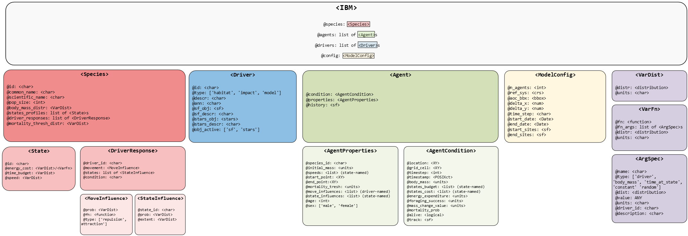

```{r, include = FALSE}
knitr::opts_chunk$set(
  collapse = TRUE,
  comment = "#>"
)
```

```{r setup}
# install.packages("pak")
# pak::pkg_install("dmpstats/roamR")

library(roamR)
library(sf)
library(tidyverse)
library(distributional)
library(stars)
library(FNN) # dependency for stars::st_warp()
library(future)
library(units)

theme_set(theme_light())
```

# Overview
Here we use `{roamR}` to simulate the movement and energetics for a population of common guillemot (_Uria aalge_) on the Isle of May. For details on the `{roamR}` package, refer to the general guide (XX), with the general achitecture repeated here:




The simulations here cover the non-breeding season (some 9 months, from July to March) under two broad scenarios:

* An environment free of Off-Shore Windfarms (OWFs) - nominally the status quo
* An environment with many synthetic OWF developments 

The overall intention is to quantify the effects of potential displacement from these developments, based on counter-factual comparisons of animal's condition under these scenarios. In keeping with the architecture of the `{roamR}` package, the following main components will be populated:

* __IBM general settings__ (`<ModelConfig>`) sundry high-level controls for the simulation, such as the number of agents, broad spatial boundaries, spatial projections, time-steps, start & finish dates.
* __Species-level information__ (`<Species>`) such as distributions governing initial bodymass, what behavioural states are possible, movement parameters, and how agents respond to their environment e.g.  avoidance of windfarms or landmass, costs associated with activity.
* __Drivers__ (`<Driver>`) descriptions/data that define the environment that agents may interact with or respond to e.g. sea surface temperatures, locations of windfarms, coastlines, prey fields etc.

The extent to which these can be populated will obviously vary, with the
guillemot chosen here as a population that is relatively well studied. `{roamR}`
is intentionally general and has substantial functionality that will not be used
in a simulation. We will populate various elements of the simulation in turn,
before turning to running the simulation and post-processing the results.


# Input data

As a relatively well-studied species/population, there are many `{roamR}` elements to populate. Mainly these are:

* Density maps
* SST
* Activity data
* Energetics
* Bodyweight
* Bodymass conversion

which will be a) described in detail and b) specified in `{roamR}` forms in the
following sections. `{roamR}` can be run with very little data (an example of a
more data sparse species is given in the test study XX), with the results being
correspondingly less informative and stochastic.


## IBM configuration

The broad configuration of the IBM is specified via the function
`ModelConfig()`.In the interest of speed, the example simulation here will not
be large in terms of the number of agents to run - we'll opt for 10 agents
(`n_agents`). The non-breeding season for these animals runs from approximately
start of July for 9 months (`start_date`, `end_date`). We'll opt for a uniform
1km^2 spatial resolution (`x_delta`, `y_delta`) and have everything operate on
the UTM 30N coordinate system (`ref_sys`). This will be the basis of ingesting
and aligning the general spatial inputs. Note: the package currently requires
all spatial inputs (e.g. density maps) to be provided in a common CRS projection
^[functionality to homogenise CRSs across spatial inputs during model
initialization is expected to be implemented in `{roamR}` in the near future].
The `{sf}` package is generally used for dealing with spatial data (and the
interlinked `{stars}` package for spatio-temporal).


```{r}
# Set UTM zone 30N
utm30 <- st_crs(32630)

```

Agent start and end locations (`start_sites`, `end_sites`) must be supplied as
`sf` objects containing two required columns: `id` (a unique site identifier)
and `prop` (the proportion of agents assigned to each site). In this example, we
use the Isle of May as the sole starting location, specified by its geographic
coordinates (longitude/latitude). Note that `end_sites` is currently ignored by
the simulation, as the movement model assumes agents remain at their final
locations once the simulation ends. As noted earlier, the site must be
reprojected to the common UTM Zone 30N coordinate reference system.


```{r}
# location of colony in long/lat degrees - start/finish locations
isle_may <- st_sf(
  id = "Isle of May",
  prop = 1,
  geom = st_sfc(st_point(c(-2.5667, 56.1833))),
  crs = 4326) 

# re-project to UTM 30N
isle_may <- st_transform(isle_may, crs = utm30)

```


In terms of bounding the entire simulation spatially, we've opted for a bounding box from a previous study applied to this species [?REFERENCE]. Note this a hard boundary in terms of simulations - data outside this will have no influence. 

```{r}
# AoC in UTM. Exact figures come from a previous lat/lon example
AoC <- st_bbox(c(xmin = 178831, ymin = 5906535,  xmax = 1174762, ymax = 6783609), crs = st_crs(utm30))
```


Passing the above configuration inputs to `ModelConfig()` creates a `<ModelConfig>` object, which we assigned to `guill_ibm_config`:

```{r}

# IBM Settings - assume fixed for these simulations

guill_ibm_config <- ModelConfig(
  n_agents = 10,
  ref_sys = utm30,
  aoc_bbx = AoC, 
  delta_x = 1000,
  delta_y = 1000,
  delta_time = "1 day",
  start_date = date("2025-07-01"),
  end_date = date("2025-07-01") + 270, 
  start_sites = isle_may
)

class(guill_ibm_config)

```

## Driver information

Drivers define the environment that agents may interact with or respond, with
each driver being specified via the `Driver()` function. In this application to
the common guillemot, the following drivers are required - all provided as
spatio-temporal datacubes (rasters):

* Monthly species density surfaces, for both baseline and impacted scenarios
* Monthly energy intake maps (kJ/h), for both baseline and impacted scenarios
* Monthly average Sea Surface Temperature (SST) maps

`{roamR}` enforces a strict requirement that all input variables be accompanied
by appropriate measurement units. This ensures that all computations performed
during simulation are unit-aware, allowing for accurate operations and
conversions.

We begin by uploading these datacubes, assigning measurement units where they are missing.

 
```{r}
# driver spatial surfaces

spec_map <- readRDS("data/bioss_spec_map.rds") |> 
   mutate(density =  units::set_units(density, "counts"))

spec_imp_map <- readRDS("data/bioss_spec_imp_map.rds") |> 
   mutate(density =  units::set_units(density, "counts"))

intake_map <- readRDS("data/guill_energy_intake_map.rds")

imp_intake_map <- readRDS("data/guill_impacted_energy_intake_map.rds")

sst_map <- readRDS("data/bioss_sst_stars.rds") |> 
  mutate(sst =  units::set_units(sst, "degree_Celsius")) |> 
  stars::st_warp(crs = sf::st_crs(spec_map), threshold  = 20028)

#plot(sst_map)

```

Next we specify the corresponding drivers, and stored the as a list of `<Driver>` objects.

```{r}
# Set up IBM drivers 

dens_drv <- Driver(
  id = "dens",
  type = "resource",
  descr = "species dens map",
  stars_obj = spec_map,
  obj_active = "stars"
)

dens_imp_drv <- Driver(
  id = "dens_imp",
  type = "resource",
  descr = "species redist map",
  stars_obj = spec_imp_map,
  obj_active = "stars"
)

energy_drv <- Driver(
  id = "energy",
  type = "resource",
  descr = "energy map",
  stars_obj = intake_map,
  obj_active = "stars"
)

imp_energy_drv <- Driver(
  id = "imp_energy",
  type = "resource",
  descr = "energy impact map",
  stars_obj = imp_intake_map,
  obj_active = "stars"
)


sst_drv <- Driver(
  id = "sst",
  type = "habitat",
  descr = "Sea Surface Temperature",
  stars_obj = sst_map,
  obj_active = "stars"
)


# store as list for initialisation
guill_drivers <- list(
  dens = dens_drv,
  imp_dens = dens_imp_drv,
  energy = energy_drv,
  imp_energy = imp_energy_drv,
  sst = sst_drv
)
```


## Species information

Species-level information is defined using the `Species()` function, which
depends on a set of input objects. For clarity and modularity, these inputs
should be prepared and specified beforehand.

### States Profile

We begin by defining the behavioural states to include in the model. Each state
represents a specific activity, characterized by parameters such as energy
expenditure, time allocation, and movement speed.

States are created using the `State()` function. `{roamR}` supports flexible
specification of state properties, allowing the incorporation of stochastic
variation at both the population and individual (agent) level.

Here we include 4 states:

* flight
* diving
* active on water (i.e. swimming)
* inactive on water (i.e. resting)

We start with the 'flight' state. For the current simulation, we assume the
energetic cost of flying for each agent varies throughout the simulation,
following a Normal distribution with mean `507.6 kJ/h` and standard deviation of
`237.6 kJ/h`. On the other hand, the average speed of each agent is fixed over
the simulation, with agents speeds drawn from a uniform distribution, as
specified below.

```{r}
# user-defined function returning the energy cost of flying
flight_cost_fn <- function(mean, sd){
  e <- rnorm(1, mean, sd)
  (max(e, 1)) |>
    units::set_units("kJ/h")
}

flight <- State(
  id = "flight", 
  energy_cost = VarFn(
    flight_cost_fn, 
    args_spec = list(mean = 507.6, sd = 237.6), 
    units = "kJ/hour"
    ), 
  time_budget = VarDist(0.056, "hours/day"), 
  speed = VarDist(dist_uniform(10, 20), "m/s")
)

```


The state representing the 'diving' activity.

```{r}
# define costing function
dive_cost_fn <- function(t_dive, alpha_mean, alpha_sd){
  alpha <- rnorm(1, alpha_mean, alpha_sd)
  (max(alpha*sum(1-exp(-t_dive/1.23))/sum(t_dive)*60, 1)) |>
    units::set_units("kJ/h")
}

# sanity check
dive_cost_fn(1, 3, 4)

# Construct <State> object
dive <- State(
  id = "diving", 
  energy_cost = VarFn(
    dive_cost_fn, 
    args_spec = list(t_dive = 1.05, alpha_mean = 3.71, alpha_sd = 1.3), 
    units = "kJ/hour"
    ), 
  time_budget = VarDist(3.11, "hours/day"), 
  speed = VarDist(dist_uniform(0, 1), "m/s")
)

```

State representing 'active on water'.

```{r}

active_water_cost_fn <- function(sst, int_mean, int_sd){
  int <- rnorm(1, int_mean, int_sd)
  (max(int-(2.75*sst), 1)) |>
    units::set_units("kJ/h")
}


# Construct <State> object
active <- State(
  id = "active_on_water", 
  energy_cost = VarFn(
    active_water_cost_fn, 
    args_spec = list(sst = "driver", int_mean = 113, int_sd = 22), 
    units = "kJ/hour"
  ), 
  time_budget = VarDist(10.5, "hours/day"), 
  speed = VarDist(dist_uniform(0, 1), "m/s")
)

```


State for 'inactive on water'.

```{r}

inactive_water_cost_fn <- function(sst, int_mean, int_sd){
  int <- rnorm(1, int_mean, int_sd)
  (max(int-(2.75*sst), 1)) |>
    units::set_units("kJ/h")
}


inactive <- State(
  id = "inactive_on_water", 
  energy_cost = VarFn(
    active_water_cost_fn, 
    args_spec = list(sst = "driver", int_mean = 72.2, int_sd = 22), 
    units = "kJ/hour"
  ), 
  time_budget = VarDist(10.3, "hours/day"), 
  speed = VarDist(dist_uniform(0, 1), "m/s")
)

```


```{r}
guill_states <- list(
  flight = flight,
  dive = dive,
  active = active,
  inactive = inactive
)
```


### Driver Responses


In this section, we define species-level, agent-specific responses to the
environmental drivers introduced and defined earlier. For the guillemot model,
we assign the density drivers - identified as `"dens"` (baseline) and
`"dens_imp"` (impacted) - as the primary determinants of agent movement. For
each scenario, we also specify the probability that an agent is influenced by
the respective driver. For driver `"dens_imp"`, this probability reflects how
likely an agent is to respond to a OWF installation.

```{r}
resp_dens <- DriverResponse(
  driver_id = "dens",
  movement = MoveInfluence(
    prob = VarDist(distributional::dist_degenerate(1)),
    type = "attraction",
    mode = "cell-value",
    sim_stage = "bsln"
  )
)

resp_imp_dens <- DriverResponse(
  driver_id = "dens_imp",
  movement = MoveInfluence(
    prob = VarDist(distributional::dist_normal(0.67, sd = 0.061)),
    type = "attraction",
    mode = "cell-value",
    sim_stage = "imp"
  )
)
```


### Create the `<Species>` object

In addition to the parameters defined above, we set the remaining species-level
properties, including the body mass distribution (used to initialise each
agent’s body mass) and the energy-to-mass conversion rate, which is assumed
constant across agents and simulated time steps.

```{r}
guill <- Species(
  id = "guill",
  common_name = "guillemot",
  scientific_name = "Uria Aalge",
  body_mass_distr = VarDist(dist_normal(mean = 929, sd = 56), "g"),
  energy_to_mass_distr = VarDist(0.072, "g/kJ"),
  states_profile = guill_states,
  driver_responses = list(resp_dens, resp_imp_dens)
)

```


# Setting up and running the IBM

## Initialisation

```{r}
guill_ibm <- rmr_initiate(
  model_config = guill_ibm_config,
  species = guill,
  drivers = guill_drivers
)

```

## Running the simulation


```{r}

plan(multisession, workers = future::availableCores() - 10)

guill_results <- run_disnbs(
  ibm = guill_ibm,
  run_scen = "baseline-and-impact", 
  dens_id = "dens", 
  intake_id = "energy", 
  imp_dens_id = "dens_imp", 
  imp_intake_id = "imp_energy", 
  feed_state_id = "diving", 
  roost_state_id = "inactive_on_water", 
  feed_avg_net_energy = units::set_units(422, "kJ/h"), 
  target_energy = units::set_units(1, "kJ"), 
  smooth_body_mass = bm_smooth_opts(time_bw = "7 days"), 
  waypnts_res = 1000, 
  seed = 1990
)


```


# Digesting the results


Output manipulation for plotting.

```{r}

# gather history from all agents, under the 2 scenarios, into one data frame
guill_history <- map(guill_results, function(scn){
  map(scn, ~.x@history) |> 
  setNames(1:10) |> 
  list_rbind(names_to = "agent") 
}) |> 
  setNames(c("status-quo", "impact")) |> 
  list_rbind(names_to = "scenario") |> 
  mutate(
    Date = as.Date(timestamp), 
    agent = as.numeric(agent),
    month = lubridate::month(timestamp)
  )

# add information on whether agents are susceptible to be influenced by the impact
infl <- tibble(
  agent = 1:10,
  suscep = purrr::map_lgl(guill_ibm@agents, ~.x@properties@move_influences$dens_imp$infl) == TRUE
)

guill_history <- left_join(guill_history, infl, by = "agent") |> st_as_sf()

guill_history
```


## Bodymass traces

```{r}

p_bdm <- guill_history |> 
  ggplot() +
  geom_line(aes(x = Date, y = body_mass_smooth, col = scenario), linewidth = 1) +
  scale_color_brewer(palette = "Set1") +
  theme(legend.position = "bottom") +
  facet_wrap(~agent, ncol = 2, scales = "free")
  
p_bdm

#ggsave("images/bodymass.png", p_bdm, width = 12, height = 12)
  
```


## Agent tracks

```{r}

p_tracks <- guill_history |> 
  drop_na(timestamp) |> 
  filter(suscep == FALSE, agent == 3) |> 
  ggplot() +
  stars::geom_stars(data = spec_imp_map) +
  geom_sf(aes(col = scenario)) +
  #scale_color_brewer(palette = "Set1") +
  scale_color_brewer(palette = "Set1") +
  scale_fill_distiller(palette = "Greys", direction = 1) +
  facet_wrap(~month, ncol = 3) +
  labs(title = "Monthtly movement tracks for a non-sensitive agent", subtitle = "Status-quo Vs Impacted scenarios")
  
p_tracks

#ggsave("images/tracks_non_susceptile_agent.png", p_tracks, width = 15, height = 15)

```


```{r}

p_tracks <- guill_history |> 
  drop_na(timestamp) |> 
  filter(suscep == TRUE, agent == 1) |> 
  ggplot() +
  stars::geom_stars(data = spec_imp_map) +
  geom_sf(aes(col = scenario)) +
  scale_color_brewer(palette = "Set1") +
  scale_fill_distiller(palette = "Greys", direction = 1) +
  facet_wrap(~month, ncol = 3) +
  labs(title = "Monthtly movement tracks for a sensitive agent", subtitle = "Status-quo Vs Impacted scenarios")

p_tracks

ggsave("images/tracks_susceptile_agent.png", p_tracks, width = 15, height = 15)

```

Activity budget

```{r}
p_activity <- guill_history |> 
  drop_na(timestamp) |> 
  filter(suscep == TRUE, agent == 1) |> 
  rename(
    flight = states_budget.flight,
    diving = states_budget.diving,
    water_active = states_budget.active_on_water,
    water_inactive = states_budget.inactive_on_water,
  ) |> 
  pivot_longer(cols = flight:water_inactive, names_to = "activity", values_to = "budget") |> 
  ggplot() +
  geom_col(aes(x = factor(timestep), y = budget, fill = activity)) +
  scale_fill_brewer(palette = "Set3", direction = -1) +
  facet_wrap(~scenario, ncol = 1) +
  theme(legend.position = "bottom") +
  labs(y = "Activity budget (day proportion)", x = "timestep", title = "Sensitive Agent")
  
p_activity

ggsave("images/activity_susceptile_agent.png", p_activity, width = 10, height = 10)
```


```{r}
p_activity <- guill_history |> 
  drop_na(timestamp) |> 
  filter(suscep == FALSE, agent == 3) |> 
  rename(
    flight = states_budget.flight,
    diving = states_budget.diving,
    water_active = states_budget.active_on_water,
    water_inactive = states_budget.inactive_on_water,
  ) |> 
  pivot_longer(cols = flight:water_inactive, names_to = "activity", values_to = "budget") |> 
  ggplot() +
  geom_col(aes(x = factor(timestep), y = budget, fill = activity)) +
  scale_fill_brewer(palette = "Set3", direction = -1) +
  facet_wrap(~scenario, ncol = 1) +
  theme(legend.position = "bottom") +
  labs(y = "Activity budget (day proportion)", x = "timestep", title = "Non-sensitive Agent")
  
p_activity

ggsave("images/activity_nonsusceptile_agent.png", p_activity, width = 10, height = 10)
```
