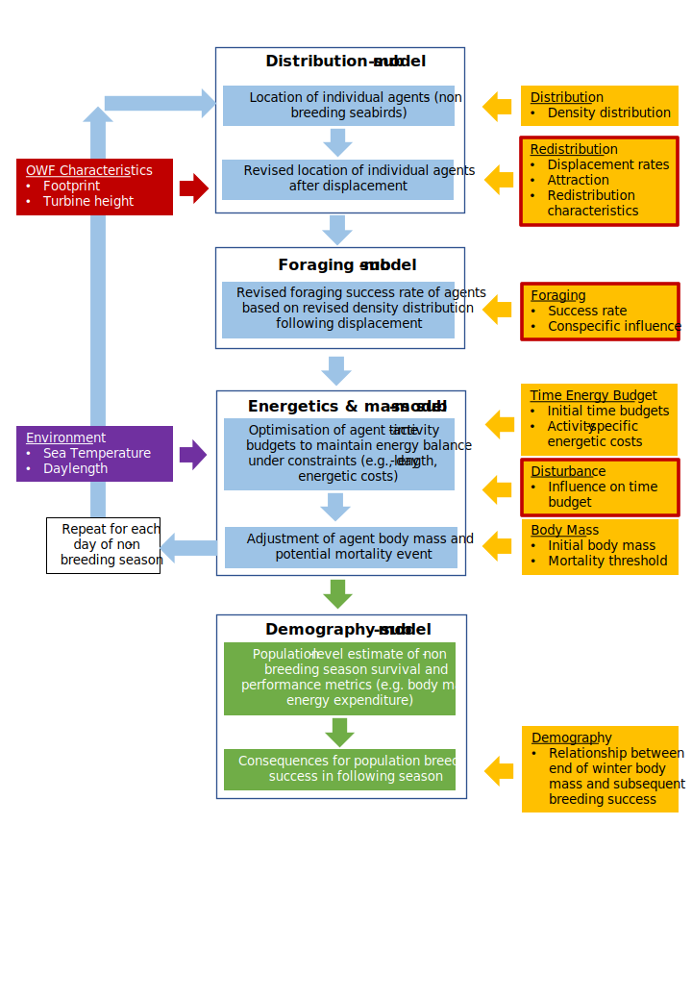

```{r, include = FALSE}
knitr::opts_chunk$set(
  collapse = TRUE,
  comment = "#>"
)
```

```{r setup, include=FALSE}
library(roamR)
```

# Introduction

`roamR` is an R package that offers a toolset and framework for running Individual Based Models (IBMs - or Agent-Based Models). It was created as part of the DisNBS project (Distribution of seabirds in the Non-Breeding Season) which was a project within the Off-shore Renewables Joint Industry Partnership programme ([ORJIP](http://www.orjip.org.uk/)). While the project has specific goals in relation to Off-shore Wind Farms (OWF) and their potential effects on seabirds, the problem is quite general. This package helps build animal movement simulations, with the general problem broken down into logical components, and imposes a level of transparent formality. This places the computational components on a common footing, leaving focus on the parametrisation and inputs/data.

IBMs are simple in principle - they simulate the movement of individual animals in response to their environment and measure properties from them e.g. their body-mass. They are particularly useful where analytical modelling is difficult and where "what-if" scenarios are sought, meaning the system can be examined with/without a speculative perturbation. They also accommodate stochasticity/uncertainty quite naturally. Typically many simulated agents are run such that uncertainty in the inputs are reflected in any measured outputs, so conclusions are tempered accordingly.

The DisNBS project is the motivating example for the package development, which seeks to simulate seabirds in the non-breeding season (the extant IBM tool SeaBORD covers the breeding season), to explore and quantify the effects of speculative OWF development scenarios. The ultimate output is a generic IBM (in terms of UK seabirds) predicting the demographic effects of displacement for seabird species in the non-breeding season

## IBM design (DisNBS workpackage 1)

The DisNBS started with a design phase, underpinned by an expert consultation workshop. The resulting generic structure is presented in figure 1, which the `roamR` package seeks to implement. The demography submodel is not formally part of the IBM, but the energetics and bodymass distributions that are generated will inform these down-stream calculations.The following document is a high-level description fo the functionality within the `roamR` package, that encompasses the design elements of figure 1. `



## Package overview

`roamR` is written in S4 and has been structured/implemented such that the simulations are well defined, but with a lot of flexibility in what the components can do. Animal IBMs are spatio-temporal and can be based on very disparate data sources - so `roamR` is particular in its treatment of space (projections etc), time and units generally (as found in the `units` package). The package was written with animals in mind (indeed one of the main classes is `Species`), but we'll use the agnostic term **agent**.

In brief - `roamR`:

-   defines the environment the animal interacts with, and how this functionally affects its movement or behaviour

-   defines how animals move, with consideration of the environment, behavoural state, or condition

-   defines the behaviours animals may engage in and how these change

-   defines the general characteristics of a type of agent (a *species* definition)

-   creates many agents with stochastic properties in line with their species definition

-   runs the agents through the simulated environment over time, for a defined temporal resolution

-   measures the agents throughout the simulation

-   gives tools to query the mass of agents that have been simulated

A principal limitation in IBMs is the level of information you have about how the agents behave. `roamR` is intended to work with very little information, up to very information rich. The test cases here cover a range of data support:

-   Relatively data rich: Guillemots at the Isle of May, which are well studied.

-   Relatively data poor: Red-Throated Divers in the North Sea, which are less understood.

In the more extreme, `roamR` has been developed with the intention of simulating very well known animal populations, for example a population with extensive GPS tagging information, that might suffice for estimation of a Hidden Markov Model. For example those demonstrated in McClintock & Michelot (2018) and subsequently fitted to detailed Fulmar track data.

## R and S4 programming

This package assumes at least some minor familiarity with R. Its use for simulating birds in the context of OWF is illustrated using markdown in the associated example scenarios - so no deep R programming is required. These examples give the steps required which can be modified and followed for new cases. However, even within this use-case it is unavoidable that user-defined functions will be required: for example the energetics equations for a particular species' activity states. There are a lot of features of the package that extend it well beyond these OWF seabird examples, but will require a deeper understanding of R.

`roamR` is written in S4 and some familiarity with this is useful generally, but particularly if you want to use the package beyond the narrow path for the bird IBMs that motivated the package. However, there is some basic S4 information that is useful to bear in mind:

-   There are well-defined classes for many components of the simulation - the R objects will often contain *slots* that you access by name with the `@` operator, as opposed to the `$` that is common for simple R objects.

-   Classes are prescriptive in what they can contain, this means things are more robust but deviations will be rejected e.g. if the data is **required** to be a `stars` object, you cannot store something else there

-   There are a lot of background checks for conformity (as above), so what you do will be scrutinised at various levels and prevented if outside expectations. For example, spatial elements must carry coordinate references systems and projections, units must be specified for many inputs.

## Dependencies

The package has been written with the intention of few dependencies on other packages. The dependencies that are needed have been chosen with stability and longevity in mind i.e. they are well maintained and programmed, where differing options are available. Notable examples are:

-   The `sf` (simple features) package, which is widely well regarded for spatial work and encompasses much functionality of other packages.

-   The `stars` packages for dealing with spatiotemporal data structures, which is characteristic of much of the data required for animal movement IBMs.

**Note:** the `units` package is used heavily. Many parameters and data elements *must* have their units of measurement specified. This is one of several formalities the package imposes, to minimise careless errors and make the simulations well defined. The help files state where these requirements apply.

# Package/class hierarchy

A great deal of thought has gone into the hierarchical structure, which means mainly the classes, how they relate to one another and therefore where data (including parameters) lies within these. This is summarised in the figures below:


Key elements of this are discussed in turn, and examples are given in the associated test scenarios. Four main areas are covered:

-   The simulation engine and wrapper - offering high-level controls, like the number of agents, spatial/temporal boundaries (e.g. a bounding box, as distinct to environmental constraints of the simulation, fundamental spatial coordinate system

-   The species - properties of the population being simulated e.g. distributions of initial body mass, flying speeds. These are often distributional, as agents/individuals will be generate from these.

-   The environment - spatiotemporal descriptions of the agent's environment within the simulation frame e.g. natural boundaries (coast), the Sea Surface Temperature (SST) over time, man-made structures (e.g. OWF)

-   The agents - the basic simulation element, largely defined from higher components, but the basis of monitoring the simulation and any counterfactuals

## General workflow to create/run an IBM

The workflow to create/populate a `roamR` IBM is in essence:

1.  Configure the simulation at a high-level, including the spatial and temporal boundaries, projections, number of agents etc.

2.  Define the species, for example initial body mass distributions, flight speed distributions, activity states and their energetic implications, functional relationships between the species and the environment e.g. how SST affects energy, how OWFs influence movement/distribution.

3.  Define the environment, essentially anything spatio-temporal that the animals are thought to respond to - coastline, man-made structures (e.g. OWF), prey distributions, SST, bathymetry etc.

4.  Combine components into an IBM object.

5.  Run a simulation, which creates agents, parallelises calculations, moves agents through the environment, and records their properties over time.

6.  Alter simulation elements to reflect a perturbation (presence of OWF).

7.  Re-run the simulation with the perturbation.

8.  Query simulated animals, with counterfactuals based on within-agent comparisons over perturbation scenarios.

The key classes that require population in this workflow are expanded upon in turn.

# The high level control (`ModelConfig`, class)

This component provides the high-level configurations for the simulation, such as the spatial and temporal boundaries, the spatiotemporal resolution, the number of agents to simulate, the projection of the spatial data, and other general parameters that define the simulation environment. This also includes start and finish points for simulated animals, if that some return-to-colony behaviour is required. Consideration in the setting of these follows.

**Bounding Box** (`aoc_bbx`) this is a spatial extent over which the agents are constrained to be within. In many cases this will simply dictated by the data, for example a density distribution for the animal being simulated. If the animals have very low probability of being beyond this data, then the bounding box constraint is a logical progression. In other cases it might be set with knowledge of the maximum range of the animal's homerange.

It is important to note that no movement outside this is permitted - so the box should be sufficiently large that it is not controversially influential i.e. err on the large side given other inputs will dictate travel. It also will bound spatiotemporal inputs, so data inputs are clipped to this region. A potential consequence of making the bounds very large is that large amounts of data be retained needlessly.

**Spatial Resolution** (`delta_x`, `delta_y`) this defines the resolution of any spatiotemporal datacubes that underpin the IBM. Note, this does not define the resolution of the movements of the agent, just the resolution of data describing its environment. This can simply be set to match the finest scale of the input data, the only cost being the size of data being carried forwards.

**Temporal Bounds** (`start_date`, `end_date`) a nominal period the simulation applies to. Some care is needed such that input data covers this period. For example, if the simulation is envisaged to be running in the future, temporal inputs should similarly be nominally for this period e.g. if using historic SST data, this needs to be timestamped for the projected simulation period.

**Number of agents** (`n_agents`) there is no strong guidance on this, but is should be a considered choice. A general rule of thumb is that more would be better (similar to any computer intensive inference) so should be "large". Note, the amount of calculation, and hence time to run the simulation, is linear with regards this. Similarly agents are tracked and stored in detail, so may result in non-negligible storage sizes.

Ultimately the the outputs will be distributions of metrics from the agents, so sufficient are needed to characterise these distributions well/stably. A balance of computation time and accuracy of the distribution shape may be needed, if computation time is large - else just select a large number. The number of agents does *not* need to match the number of individuals in the population being simulated, they represent a sample of potential realities or animals as for any computer-intensive inference.

# Defining the species (`Species` class)

This provides the general features that are realised in the agents, either stochastically (e.g. initial body mass) and/or functional relationships with the environment (e.g. how SST affects energy expenditure). It has been named *species* but could be considered a population depending on the context e.g. if there are parameters known down to a colony level, and potentially different from other colonies.

*[Note the package also has a `varDist` class, which gives a common interface in setting stochasticity, based on the `distributional` package]*

**Labels** (`id`, `common_name`, `scientific_name`) these are used to identify the species in the simulation, and can be used to query the simulation results. They are not used in any functional way, but are useful for labelling outputs and queries.

**Body mass** (`body_mass_distr`) this is a distribution of the initial body mass of the agents, which can be defined as a `VarDist` object. This is used to initialise the agents with a body mass that reflects the population being simulated. The distribution can be defined using any of the supported distributions in `VarDist`, such as normal, log-normal, or gamma distributions.

**Mortality Threshold** (`mortality_thresh_distr`) defines thresholds where agents are considered to have died, based on their body mass. Note, agents are nominally tracked through the simulation even if marked as dead. This allows other post-processing relationships to be explored, such as defining fatality as a function of time spent below a %-age of starting body mass.

**Population Size** (`pop_size`) this is a nominal size of the population being simulated, which can be used to optionally scale the results of the simulation.

**Activity States** (`activity_states`) this is a list of `ActivityState` objects, which define the different states that the agents can be in, such as foraging, resting, or flying. Each state has a name, a distribution of body mass loss, and a distribution of flight speed. The states can be defined with different distributions for different species, and can be used to model the behaviour of the agents in the simulation.

**Response to Environment** (`driver_responses`) these are custom defined functions that relate species (and therefore agent) behaviour with regards their environment, as represented by the `Driver` class. These are a very flexible element of the simulation, so expanded upon below.

## Driver responses

A key element of the IBM is the responsiveness of the agents to their environment, which includes standard biological factors such as prey distributions, bathymetry or coastlines. Treated generally, this also includes anthropogenic factors such as OWF, which are the focus of perturbation scenarios to be explored in the IBM. These are collectively termed **drivers**, as they drive agents behaviour, including movement, activity states and by extension their distribution and energetics.

The drivers are encompassed in the `Driver` class below, which might be themselves general and not species-specific. Here within the `Species` class, the link between the environment is made explicit and species-specific. These are very general, being user-defined functions that relate specific driver information to behaviour. For example:

-   Relationships between movement and proximity to coast. The coast movement driver in this case is distance to coast, calculated internally from coastline polygons. The correlated random walk movement model is fundamentally direction and speed, so a sharply declining driver response influences agents away from coastlines.

-   Relationships between movement and OWF. The coast movement driver in this case is internally calculated distance to development(s), and the driver function can call on properties of the development e.g. height of turbines, simulating line-of-sight influences or similar. Relatedly, this can simply be a barrier effect - the agent cannot pass through an OWF footprint/polygon (noting a specified proportion of agents can been set to be sensitive to OWF, also through the species definition).

## States: activity budgets and rebalancing

The possible activity states of agents are defined within the species definition as above. A design element of the IBM is that the daily activity budget (time spent in each state) is not fixed, and can be responsive to environment and agent condition. `roamR` allows a "state rebalancing" on a daily basis, with the rationale that agents will attempt to compensate for poor foraging say, by increasing the amount of time dedicated to feeding. 

`roamR` allows for this state distribution to be dependent the previous day's net energy intake. To achieve this, a target daily net energy is specified e.g. for a species that is thought to have similar weights at beginning and end of the season, this target is zero. A day with poor energy intake will attempt to be compensated for, by a subsequent increase in time spend feeding. This adjustment is made such that:

* The change in activity budget would on average balance out the previous days' intake against the energy target. Note this will not be exact, as the daily energy intake achieved is subject to stochastic elements.

* The changes in activity to seek energy balance are primarily through increasing/decreasing feeding and resting times.

* Agents are constrained to rest overnight, which is based on day length calculations for the agent's location and time.

* All activities outside explicit feeding and resting are scaled accordingly, such that a full day's activities are defined (i.e. a probability distribution for the day is maintained). 


# Defining the environment (`Driver` class)

Information about the simulated environment which might be influential on agent's behaviour is encapsulated in the `Driver` class. Generally these are spatiotemporal data cubes (a data structure here that is effectively a series of maps stacked by time), such that the agents can query them for any time and location. The actual information contained within the driver can be of varying detail (e.g. low spatial resolution, fixed over time, or highly detailed spatial information that varies with time) but the interface to this is consistent: the agent queries all relevant drivers at location $x$, $y$ at time $t$.

## Vector fields

Generally animals are not simply responsive to their immediate environment, for example favoured feeding grounds that are not immediately within their sensory range. `roamR` includes the calculation of vector fields, which give direction and slope for any point on a provided surface. In conjunction with the driver response functions, this allows the IBM to direct movement through the environment towards distant favoured regions, or conversely away. Distance and direction to nearest OWF development, or coastline being particular examples.

# The basic unit (`Agent` class)

The agents within the simulation are treated as self-contained entities, that are moved and measured through the environment subject to their individual properties. The specified number of agents are created at the start of the simulation, with their properties defined by the `Species` class. Initialisation of the agents is done by sampling from the distributions defined in the `Species` class, such as initial body mass, flight speed, and activity state.

## Agent properties

At initialisation, the following (non-exhaustive) properties are generated for each agent. These are fixed throughout the simulation, being fundamental to the agent for a simulated season:

**initial_mass** ⁠`units`⁠ object, the agent's body mass at the start of the simulation.

**speeds** a named list, defining movement speed properties for the agent. Each element specifies the agent's average speed for a given movement state (e.g. flying, swimming, etc). List elements must be of type ⁠`units`⁠.

**start_point**, **end_point** objects of spatial class `XY`, the spatial coordinates of the agent at the start and end of the simulation, respectively.

**mortality_thresh** ⁠`units`⁠ object, the threshold body mass below which the agent is assumed to die.

**move_influences** a named list, defining whether the agent is influenced by model drivers. Each element corresponds to a driver_id (which must be defined in the model's Driver object) and contains a single-row data.frame with columns:

-   p: numeric, providing the probability that the agent is influenced by the named driver.

-   infl: logical, whether the agent is influenced by the driver. It should be determined via a Bernoulli trial with probability p.

**state_influences** a named list, defining whether agent states are influenced by model drivers. Each element, named after a driver_id, contains a data.frame with columns:

-   state_id: character string, the unique identifier of an agent's state.

-   p: numeric, the probability that the agent's state_id is influenced by the driver.

-   infl: logical, whether the agent's state_id is influenced by the driver. It should be determined via a Bernoulli trial with probability p.


## Agent condition

The agent's condition is a dynamic aspect of the simulation, which is updated at each time-step. It includes the agent's current location, body mass, activity states, and other properties that change over time. The condition is updated based on the agent's movement, activity states, and interactions with the environment:

**location** object of class XY, specifying the agent's spatial coordinates at the end of the current time-step.

**grid_cell** object of class XY, representing the AOC's grid-cell occupied by the agent.

**timestep** integer, indicating the current simulation time-step index.

**timestamp** a ⁠`POSIXct`⁠ object, the date-time at the end of the current time-step.

**body_mass** a ⁠`units`⁠ object, defining the agent's body mass at the end of the current time-step.

**states_budget** a named list, detailing the agent's time allocation across the different behavioural/activity states during the time-step. Each element (of type ⁠`units`⁠) is named after a specific state and stores the duration (e.g. hours) the agent spent in that state.

**states_cost** a named list, specifying the energy costs (e.g. KJ/hr/g) associated with each state defined in state_budget. List elements are of type ⁠`units`⁠.

**mortality_prob** numeric, the probability of the agent dying within the the current time-step (currently ignored).

**alive** a logical value (TRUE if alive, FALSE if dead), indicating whether the agent has survived the time-step.

**track** object of class sf, storing a time-series of location points tracking the agent's movement within the current time-step.

**energy_expenditure** a ⁠`units`⁠ object, representing the total energy (e.g. KJ/g) expended across all states during the time-step.

**foraging_success** a ⁠`units`⁠ object, the mass of prey (e.g. grams) consumed by the agent in the current time-step.

**mass_change_value** a ⁠`units`⁠ object, capturing the net change in the agent’s body mass (e.g., grams) over the current time-step.

## Agent history

The agent's condition is generally dynamic throughout the simulation and can be sufficient to answer questions motivating the IBM e.g. body-mass at the end of season. More generally however, a full record may be sought so the agent class contains a history component which stores the agent's condition in a spatiotemporal data structure. This allows examination of movement, time spent in behaviour states, physical condition etc at any point in time.

# Moving agents, running the simulation (`IBM` class)

Fundamental to the IBM is the movement of agents. Currently `roamR` supports two movement models, which have different data/input requirements: one relatively simple requiring only basic knowledge of an animals speed of movement, the other a more demanding correlated random walk that would require detailed tracking data and parameter estimation from a Hidden Markov Model (HMM).

## Movement models

Two agent movement methods are supported, presented here in order of complexity/data requirements.

**Density informed** this method uses density information to generate stochastic destinations for the agents, which are combined with activity budgets and basic speed information to give travel paths. The process is:

1.  Use the species' density information in a likelihood fashion to generate a target destination for an agent i.e. high density areas are relatively more likely to be chosen.

2.  Determine a feasible path from the current location to the destination - *feasible* here meaning that the path does not cross any barriers that apply from the driver response functions (e.g. OWF, coastlines) and is within the bounding box of the simulation.

3.  The agents travel along the path is constrained/dictated by the agent's speed properties and activity budget over time, for example an hour of flying within a day coupled with an average speed is used to calculate expected travel distances, under assumed random walk properties.

4.  Iteratively regenerate destinations and paths

**Correlated Random Walk (CRW)** this method is commonplace in movement simulation literature, and consists of iteratively generating stochastic movement directions, then making a stochastic step. The distributions can impose dependencies to provide a directed random walk, and when related to local drivers, be functionally responsive to the environment. The process is primarily:

1.  Select a stochastic movement direction based on a circular distribution (wrapped Normal in `roamR`). The mean (direction) of the distribution may be functionally related to local conditions e.g. vector field giving distance and direction to OWF. The variance of this distribution imposes the correlation (low variance is very directed movements).

2.  Select a stochastic step length based on a distribution (e.g. gamma).

3.  Iterate.

The properties of this movement can be made state dependent e.g. flying (fast and directed), resting (stationary) - depending on the species definition.

The second of these movement models is data intensive, requiring detailed tracking information to parameterise.

## Agent evaluations

At each movement step the agents are evaluated, which includes simple location, but storing or calculating multiple properties:

-   The location and time

-   Activity state(s)

-   The cumulative net energy - based on user definitions, but generally a function of environment and activity state e.g. the amount of time in a feeding state, stochastic energy loss combined with local SST and balanced against energy intake.

-   Direction of travel, speed, depending on movement model.

-   Agent body-mass, depending on population of energy-to-mass conversion functions

Additionally, state transitions for the next step may be calculated - as described in the state balancing section previously, where $t+1$ activity states are related to energy intakes at time $t$.

# Querying the simulation, counterfactuals

A principal use of the IBM is to run counterfactuals, where the simulation is run with and without a perturbation, such as the presence of an OWF. There are run in `roamR` in a paired fashion: the same agents are used in both scenarios, with changes only imposed on the definitions of the environment. Maintaining the same random seed sequence in both cases means the paired agents will start with the same properties, and subject to the same stochastic influences except where the purturbation creates changes.

Quantification of the impact of the perturbation can be done on any of the defined agent condition (and/or history), but likely to be differences in:

-   Cumulative net energy

-   Season-end body mass or mass change

-   Distributions of activity/behavioural states

-   Minimum body-mass over the season

-   (relatedly) Mortality

As a mass-agent IBM, these are not single values, but distributions representing the variability in the simulated populations e.g. the distribution of differences in end-of-season body mass from baseline compared to OWF perturbation. These directly informative at a population level, and tangible for down-stream calculations. For example, passed to Population Viability Analyses (PVAs) where counterfactuals may use:

-   Increases in mortality/proportional reductions in population size

-   Relationships between body mass and reproductive success, to alter PVA demographic parameters

# Installation

`roamR` is not currently on CRAN - installation is direct from github. You can use devtools to install:

```{r, eval=FALSE}

devtools::install_github(“dmpstats/roamR”, ref = "master")
```

Noting an authorisation token may be required if the repository is not yet public.

# References

McClintock BT, Michelot T (2018). “momentuHMM: R package for generalized hidden Markov models of animal movement.” Methods in Ecology and Evolution, 9(6), 1518-1530. doi:10.1111/2041-210X.12995, http://dx.doi.org/10.1111/2041-210X.12995.
